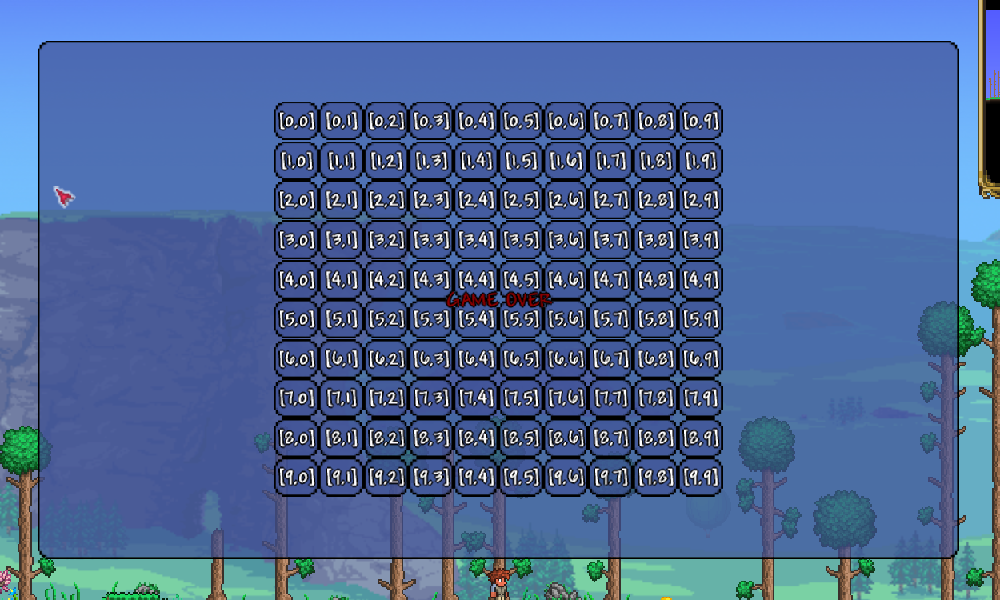

<h1 align="center">Класс <code>UIExLayout</code>. Основы компоновки</h1>

----

- Данная библиотека предполагает, что вы уже изучили [базовое руководство tModLoader по пользовательскому интерфейсу](https://github.com/tModLoader/tModLoader/wiki/Basic-UI-Element)<br>
- Данная библиотека предполагает, что вы уже изучили [расширенное руководство по настройке пользовательского интерфейса](https://github.com/tModLoader/tModLoader/wiki/Advanced-guide-to-custom-UI)<br>
- Данная статья предполагает, что вы изучили статью: [«структура стилей»](../Раздел-1/1.3-StyleStructure.md)

----
<br>

Класс `UIExLayout` является базовым классом для элементов компоновки. Он реализует:
1. Жизненный цикл компоновки элементов.
2. Стили компоновки контейнера, которые поддерживает любой элемент компоновки.
3. Организует хранения стилей компоновки вложенных элементов и доступ к ним.
4. Вспомогательные статические методы `Wrap`, которые будут описаны в данной статье.
5. Инструменты оптимизации, часть из которых отдается во внешнее управление (из-за внутренних ограничений **tModLoader**).
<br>

- В данной статье будут разобраны эти пункты, кроме: 
- Пункта 1 — жизненный цикл компоновки. Будет разбираться в отдельной части данного раздела. Вам нужно понимать жизненный цикл, только если вы планируете писать свой компоновщик на основе данной библиотеки.
- Пункта 5 — инструменты оптимизации. Будут разбираться в отдельной части ванного раздела.
- Пункта 3 — частично будет разобран в данной статье, частично - в отдельной части ванного раздела.

----

**Рекомендация**: рекомендуется изучать данный раздел следующим образом:
1. Изучить данную статью.
2. Выбрать любой элемент компоновки и изучить его.
3. Изучить часть данного раздела по инструментам оптимизации.
4. Изучить все прочие элементы компоновки.
5. Изучить статью данного раздела, посвященную жизненному циклу (можно пропустить, если вы не планируете писать свои элементы компоновки на основе данной библиотеки).
6. Изучить статью данного раздела, посвященную рекомендациям по созданию пользовательского интерфейса.
- **ВАЖНО!** Не пишите реальные проекты с помощью компоновщиков данной библиотеки до изучения части данного раздела по оптимизации. Разница в производительности может быть тысячекратной.

----

<h2 align="center">Стили компоновки контейнера и вложенных элементов</h2>

Класс `UIExLayout` определяет поле:

```csharp
public Styles.StyleLayoutContainer StyleLayout;
```

Данное поле содержит стили компоновки, которые реализует любой контейнер компоновки.<br>

Тип данных `Styles.StyleLayoutContainer` имеет следующую реализацию:
```csharp
public class StyleLayoutContainer() : Base.StyleLayoutContainerBase
{
    public UIExOrientation Orientation = UIExOrientation.Vertical;
    public UIExAlignment JustifyContent = UIExAlignment.Auto;
    public UIExAlignment AlignItems = UIExAlignment.Auto;
}
```

- `Orientation` определяет, какая ось будет считаться главной для контейнера, а какая - поперечной.
- `JustifyContent` и `AlignItems` указывает, как будут выравниваться элементы по главной и поперечной осям. `UIExAlignment` может принимать следующие значения:
  - `Start`: выравнивание по началу главной / поперечной оси.
  - `Center`: выравнивание по центру главной / поперечной оси.
  - `End`: выравнивание по концу главной / поперечной оси.
  - `Stretch`: растягивает по главной / поперечной оси.
  - `Auto`: данное значение используют только вложенные в контейнер элементы (см. ниже). Использование данного значения для `JustifyContent` и `AlignItems` будет приравнено к значению `Start`.

----

Класс `Styles.StyleLayoutChild` определяет стили компоновки для дочерних элементов контейнера.

```csharp
public class StyleLayoutChild : Base.StyleLayoutChildBase
{
    public UIExAlignment JustifySelf = UIExAlignment.Auto;
    public UIExAlignment AlignSelf = UIExAlignment.Auto;
	
	public UIExThickness Margin = new();

	public bool WithoutLayout = false;

	public StyleDimension Width = default(StyleDimension);
	public StyleDimension Height = default(StyleDimension);
}
```

`JustifySelf` и `AlignSelf` определяет, как элемент будет выравниваться по основной / поперечной оси. Выше мы уже разбирали значения `UIExAlignment`. Кроме значения `Auto`. И для дочерних элементов контейнера это значение является ключевым.<br>

Если у контейнера значение `JustifyContent == UIExAlignment.Center` - это означает, что все элементы внутри контейнера будут располагаться по центру (центру чего именно - зависит от компоновщика) по главной оси. И это правило работает для всех дочерних элементов, у которых значения `JustifySelf == UIExAlignment.Auto`.<br>

`Auto` для вложенного элемента означает, что он возьмет значение контейнера. Любое другое значение `JustifySelf` переопределит `JustifyContent` для этого конкретного элемента.<br>

Для `AlignSelf` ситуация аналогичная для поперечной оси.<br>

Про `Margin`, `Width`, `Height` мы подробнее поговорим ниже.<br>

----

<h2 align="center">Выключение элемента из компоновки</h2>

```csharp
public bool WithoutLayout = false;
```

Это поле отвечает за то, будет ли элемент игнорироваться при компоновке.<br>
Все способы изменения размера и расположения для такого элемента остаются стандартными для **tModLoader**
Например: представим, что мы создаем панель для игры в сапера. 
- Должна быть основная панель игры (в которую можно будет добавить игровое поле, настройки и т.д.)
- Само игровое поле.
- И вывод текста "GAME OVER" прям по центру игрового поля.

<p align="center">
  
  <br>
  <em>Рис. 1.1. Макет (упрощенный) игры «сапер»</em>
</p>

```csharp
// метод OnActivate() в данном случае используется только
// для функции «горячей перезагрузки кода» в среде разработки.
// для реального интерфейса правильнее было бы использовать
// метод OnInitialize()
public override void OnActivate()
{
    RemoveAllChildren();

    // Макет (кратно урезанный) игры: Сапер

    // Создается панель занимающая 60% экрана и располагающаяся по центру.
    UIPanel panel = new();
    Append(panel);

    // написанный для примера метод. НЕ определен в самой библиотеке.
    SetPrecentSize(panel, left: 0.2f, top: 0.2f, width: 0.6f, height: 0.6f);


    /////////////////////////////////


    // Создается панель UniformGrid 10х10 и в нее добавляются кнопки.
    // Сама Grid панель помещается в panel и занимает width: 50%; height: 80% от размеров panel.
    UIExUniformGrid grid = new();
    panel.Append(grid);

    SetPrecentSize(grid, left: 0.25f, top: 0.1f, width: 0.5f, height: 0.8f);

    int rows = 10, columns = 10;
    

    /////////////////////////////////


    // Указываем, что добавленные в UniformGrid кнопки должны занимать 100% размера ячейки.
    grid.StyleLayout.JustifyContent = UIExAlignment.Stretch;
    grid.StyleLayout.AlignItems = UIExAlignment.Stretch;

    for (int row = 0; row < rows; row++)
        for (int column = 0; column < columns; column++)
        {
            UIButton<string> button = new($"[{row},{column}]");
            grid.Append(button);
        }

    // Создает текст. Он добавляется в grid.
    UIText text = new("GAME OVER");
    text.TextColor = Color.DarkRed;
    StyleLayoutChild styleText = text.StyleLayoutChild();

    // Указываем, что UniformGrid не должен управлять компоновкой text
    // Это значит, что использоваться будет Canvas tModLoader
    styleText.WithoutLayout = true;

    // Указываем, что текст должен быть ровно в центре grid.
    text.HAlign = 0.5f;
    text.VAlign = 0.5f;
    grid.Append(text);
}
```

Если вы хотите для расположения элементов использовать только данную библиотеку, то для данной задачи можно было бы использовать `UIExCanvas`. В этом случае часть кода заменяется.<br>
Эта часть кода:
```csharp
// Создает текст. Он добавляется в grid.
UIText text = new("GAME OVER");
text.TextColor = Color.DarkRed;
StyleLayoutChild styleText = text.StyleLayoutChild();

// Указываем, что UniformGrid не должен управлять компоновкой text
// Это значит, что использоваться будет Canvas tModLoader
styleText.WithoutLayout = true;

// Указываем, что текст должен быть ровно в центре grid.
text.HAlign = 0.5f;
text.VAlign = 0.5f;
grid.Append(text);
```

Заменяется на:
```csharp
UIExCanvas canvas = new();
canvas.Stretch();

UIText text = new("GAME OVER");
text.TextColor = Color.DarkRed;

canvas.StyleLayoutChild().WithoutLayout = true;

canvas.StyleLayout.JustifyContent = UIExAlignment.Center;
canvas.StyleLayout.AlignItems = UIExAlignment.Center;

canvas.Append(text);
grid.Append(canvas);
```

----

<h2 align="center">Позиция и размеры вложенных элементов</h2>

О позициях вам нужно знать следующее:
- Компоновщики никогда не смотрят на значения `Left`, `Top` класса `UIElement`.
- Компоновщики устанавливают эти значения, игнорируя их значения, установленные до компоновки.<br>
<!-- -->
- Только один компоновщик позволяет задавать абсолютные координаты элемента: `UIExCanvas`.
- `UIExCanvas` позволяет задавать **4** абсолютные координаты с помощью специального класса стилей вложенных элементов.
- Все прочие компоновщики используют совершенно другие системы.<br>
<!-- -->
Подводя итог:
- Значения `Left` и `Top` элементов вложенных в компоновщик не влияют на компоновку, и после компоновки, скорее всего, будут отличаться от своих значений до нее.<br>

----

О размерах вам нужно знать следующее:
- Компоновщики никогда не смотрят на значения `Width`, `Height` класса `UIElement`.
- Компоновщики устанавливают эти значения, игнорируя их значения, установленные до компоновки.<br>
<!-- -->
- Изначальные размеры устанавливаются с помощью `Width` и `Height` класс `StyleLayoutChild`.
- Эти значения размеров из класса стилей используют только компоновщики. Вне компоновщиков - они ничего не делают.
- `MinWidth`, `MaxWidth`, `MinHeight` и `MaxHeight` используются в обычном режиме. Данных полей нет у класса `StyleLayoutChild`, и их значения берутся из `UIElement`.<br>
<!-- -->
Зачем компоновщику отдельные идентичные поля?
- Часть компоновщиков одновременно меняет размеры и компонует исходя из изначальных размеров элементов.
- Таким образом, компоновщик может изменить размер, установить поля `Width` и `Height` определенные в `UIElement` и при следующей компоновке изначальные размеры будут утеряны.
- Таким образом, компоновка будет давать совершенно разные результаты с каждой своей итерацией.
- Для исключения данной проблемы и были введены отдельные поля размеров.
 
----

<h2 align="center"><code>Margin</code>, <code>Padding</code>, <code>Stretch</code> и 3 области элемента</h2>

Этот раздел содержит подробное описание модели компоновки библиотеки.
Эта информация особенно важна в 3 случаях:
1. Вы планируете самостоятельно рисовать элементы на экране (тогда просто `Left`, `Top`, `Width`, `Height` использовать не выйдет).
2. Вы планируете писать собственный компоновщик на основе данной библиотеки.
3. Вы хотели бы понять, как по какому общему принципу компоновщик располагает элементы (учитывая `Margin`, `Padding`, `Stretch`, свою область и области элементов).

Каждый элемент имеет 3 области (координаты верхнего-левого угла + размер):
1. Область самого элемента.
2. Внешняя область элемента.
3. Внутренняя область элемента.<br>

Любые контейнеры компоновки работают **исключительно** с внешней областью элемента.<br>
Это главное, что вы должны знать при работе с компоновщика данной библиотеки или созданием собственных.<br>
Контейнеру не важны обычная или внутренняя область элемента.<br>
Контейнеру важны только:
1. Своя внутренняя область.
2. Внешняя область дочерних элементов.

**Область самого элемента** - это не просто `Left`, `Top`, `Width`, `Height`.<br>
`Left` и `Top` - это смещение элемента относительно внутренней области родительского элемента. 
После пересчета `UIElement` хранит область элемента так:
1. `X-области`: `X` внутренней области родителя (в абсолютной координате от начала экрана) + `Left-элемента`.
2. `Y-области`: `Y` внутренней области родителя (в абсолютной координате от начала экрана) + `Top-элемента`.
3. `ActualWidth-области`: `Clamp(Width, MinWidth, MaxWidth)`.
4. `ActualHeight-области`: `Clamp(Height, MinHeight, MaxHeight)`.<br>

То есть область элемента - это его абсолютные координаты **X/Y** от начала экрана + размер элемента, ограниченный `Min` и `Max`.

----

**Область самого элемента (пункт 1)** определяется (у компоновщиков данной библиотеки) следующим алгоритмом:
1. Берется размер области свободного пространства (выделенное компоновщиком) для размещения.
2. Исходя из размера области выделенного пространства и значений (`Width`, `MinWidth`, `MaxWidth`, `Height`, `MinHeight`, `MaxHeight`) определяется размер элемента.
3. Исходя из смещения области выделенного пространства и значений `Top` и `Left` определяется текущее положение элемента (относительно начала экрана, а не родительского элемента).
Например:
```csharp
// метод OnActivate() в данном случае используется только
// для функции «горячей перезагрузки кода» в среде разработки.
// для реального интерфейса правильнее было бы использовать
// метод OnInitialize()
public override void OnActivate()
{
    RemoveAllChildren();

    UIExCanvas canvas = new();
    canvas.Left.Precent = 0.1f;
    canvas.Top.Precent = 0.1f;
    canvas.Width.Precent = 0.8f;
    canvas.Height.Precent = 0.8f;

    UIPanel innerPanel = new();

    StyleLayoutChild innerPanelStyle = innerPanel.StyleLayoutChild();
    StyleLayoutChildCanvas innerPanelStyleCanvas = innerPanelStyle.Canvas();

    innerPanel.MaxWidth.Set(50f, 0f);
    innerPanelStyle.Width.Pixels = 100f;
    innerPanelStyle.Height.Precent = 0.5f;

    innerPanelStyleCanvas.Left.Pixels = 50f;
    innerPanelStyleCanvas.Top.Pixels = 50f;

    canvas.Append(innerPanel);
    Append(canvas);
}
```
1. `canvas` начинается с 10% от высоты/ширины экрана и имеет размер в 80% высоты/ширины экрана. Это и есть область canvas.
2. `innerPanel` имеет ширину: 100 пикселей и максимальную ширину 50 пикселей. Ширина области будет - 50 пикселей.
3. `innerPanel` имеет высоту: 50% от высоты родительского элемента.
4. `innerPanel` смещена на 50 пикселей по `Left` относительно родительского элемента. Значит `X-области` будет: 10% от ширины экрана + 50 пикселей.
5. `innerPanel` смещена на 50 пикселей по `Top` относительно родительского элемента. Значит `Y-области` будет: 10% от высоты экрана + 50 пикселей.<br>

Представим, что наш экран размером `1000x500`, тогда:<br>
Область `canvas`:
1. `X`: 1000 * 0.1 = 100px;
2. `Y`: 500 * 0.1 = 50px;
3. `Width`: 1000 * 0.8 = 800px;
4. `Height`: 500 * 0.8 = 400px;<br>

И тогда область `innerPanel` вычисляется так:
1. `X`: `область-canvas-x` + `innerPanelStyleCanvas.Left` >>> `100px + 50px`.
2. `Y`: `область-canvas-y` + `innerPanelStyleCanvas.Top` >>> `50px + 50px`.
3. `Width` `Width = 100px`, `MaxWidth = 50px` >>> 50px;
4. `Height`: `область-canvas-Height * 0.5 = 400px * 0.5`.<br>

Результат:
1. `X`: `150px`.
2. `Y`: `100px`.
3. `Width`: `50px`.
4. `Height`: `200px`.

----

**Внешняя область** элемента. Это **область элемента** + Margin (но с нюансами, о которых написано ниже).<br>

Модифицируем код ранее:
```csharp
// метод OnActivate() в данном случае используется только
// для функции «горячей перезагрузки кода» в среде разработки.
// для реального интерфейса правильнее было бы использовать
// метод OnInitialize()
public override void OnActivate()
{
    RemoveAllChildren();

    UIExCanvas canvas = new();
    canvas.Left.Precent = 0.1f;
    canvas.Top.Precent = 0.1f;
    canvas.Width.Precent = 0.8f;
    canvas.Height.Precent = 0.8f;

    UIPanel innerPanel = new();

    StyleLayoutChild innerPanelStyle = innerPanel.StyleLayoutChild();
    StyleLayoutChildCanvas innerPanelStyleCanvas = innerPanelStyle.Canvas();

    innerPanel.MaxWidth.Set(50f, 0f);
    innerPanelStyle.Width.Pixels = 100f;
    innerPanelStyle.Height.Precent = 0.5f;

    innerPanelStyleCanvas.Left.Pixels = 50f;
    innerPanelStyleCanvas.Top.Pixels = 50f;

    innerPanelStyle.Margin = new(
        pixels: true,
        left:   25f,
        top:    50f,
        right:  75f,
        bottom: 100f);

    canvas.Append(innerPanel);
    Append(canvas);
}
```
Область `innerPanel`:
1. `X`: `150px`.
2. `Y`: `100px`.
3. `Width`: `50px`.
4. `Height`: `200px`.<br>

А внешняя область считается следующим образом:
1. `outer-X`: `X - Margin.Left`.
2. `outer-Y`: `Y - Margin.Top`.
3. `outer-Width`: `Width + Margin.Left + Margin.Right`.
4. `outer-Height`: `Height + Margin.Top + Margin.Bottom`.<br>

Внешняя область `innerPanel`
1. `outer-X`: `150px - 25px = 125px`.
2. `outer-Y`: `100px - 50px = 50px`.
3. `outer-Width`: `50px + 25px + 75px = 150px`.
4. `outer-Height`: `200px + 50px + 100px = 350px`.<br>

И тут важный момент. Размер самого элемента, который вы видите на экране - это всегда размер области (не внешней или внутренней).<br>
Размер внешней области влияет только на то, сколько по мнению компоновщика занимает пространства элемент.<br>
В данном случае - элемент визуально будет занимать `50x200px`. Но для компоновщиков (например `UIExGrid`) - элемент будет занимать `150x350px`.<br>
Если данный элемент будет находиться в `UIExGrid` в ячейке, которая должна сама подстраиваться под размер элемента в ней - она будет подстраиваться под размер `150x350px`, то есть ячейка будет больше видимого размера элемента.

Маленький итог по `Marign`:
1. `Margin.Top` и `Margin.Left`: увеличивают внешнюю область и создают пространство между верней/левой границей внешней области и областью элемента.
2. `Margin.Right` и `Margin.Bottom`: увеличивают внешнюю область и создают пространство между правой/нижней границей внешней области и областью элемента.<br>
Таким образом, `Margin` не изменяет размер области самого элемента — он изменяет пространство, которое компоновщик резервирует вокруг этой области

----

**Внутренняя область элемента** - это область, где, по «мнению» данного элемента, должны располагаться вложенные в него элементы.<br>
По умолчанию **область элемента** и **внутренняя область** одинаковые.<br>
Внутренняя область задается при помощи `PaddingLeft`, `PaddingTop`, `PaddingRight`, `PaddingBottom`.<br>
Аналогов этих полей нет в данной библиотеке (для `UIElement`) нет. Эти значения корректно использовать напрямую у любого `UIElement`.<br>

В библиотеке используется собственный `Padding` в отдельных контейнерах компоновки, но он никогда не задается напрямую `UIElement`.<br>

Помимо этого, `PaddingLeft`, `PaddingTop`, `PaddingRight`, `PaddingBottom` могут управляться автоматически классом `UIExElement`.<br>
Смотрите более подробную информацию в разделе 3: «Класс `UIExElement`».<br><br>

Область `innerPanel`:
1. `X`: `150px`.
2. `Y`: `100px`.
3. `Width`: `50px`.
4. `Height`: `200px`.<br>

Внутренняя область считается следующим образом:
1. `inner-X`: `X + PaddingLeft`.
2. `inner-Y`: `Y + PaddingTop`.
3. `inner-Width`: `Width - PaddingLeft - PaddingRight`.
4. `inner-Height`: `Height - PaddingTop - PaddingBottom`.<br>

Допустим:
```csharp
innerPanel.PaddingLeft = 10f;
innerPanel.PaddingTop = 20f;
innerPanel.PaddingRight = 30f;
innerPanel.PaddingBottom = 40f;
```

Тогда внутренняя область `innerPanel`:
1. `inner-X`: `150px + 10px = 160px`.
2. `inner-Y`: `100px + 20px = 120px`.
3. `inner-Width`: `50px - 10px - 30px = 10px`.
4. `inner-Height`: `200px - 20px - 40px = 140px`.<br>

Подведем итог примером:
```csharp
// метод OnActivate() в данном случае используется только
// для функции «горячей перезагрузки кода» в среде разработки.
// для реального интерфейса правильнее было бы использовать
// метод OnInitialize()
public override void OnActivate()
{
    RemoveAllChildren();

    UIExCanvas canvas = new();
    canvas.Width.Precent = 1f;
    canvas.Height.Precent = 1f;

    canvas.PaddingLeft = 20f;
    canvas.PaddingTop = 40f;
    canvas.PaddingRight = 60f;
    canvas.PaddingBottom = 80f;

    UIPanel innerPanel = new();

    StyleLayoutChild innerPanelStyle = innerPanel.StyleLayoutChild();
    StyleLayoutChildCanvas innerPanelStyleCanvas = innerPanelStyle.Canvas();

    innerPanel.MaxWidth.Set(50f, 0f);
    innerPanelStyle.Width.Pixels = 100f;
    innerPanelStyle.Height.Precent = 0.5f;

    innerPanelStyleCanvas.Left.Pixels = 50f;
    innerPanelStyleCanvas.Top.Pixels = 50f;

    innerPanelStyle.Margin = new(
        pixels: true,
        left:   15f,
        top:    25f,
        right:  35f,
        bottom: 45f);

    canvas.Append(innerPanel);
    Append(canvas);
}
```

В данном примере `canvas` занимает 100% ширины и высоты экрана. Это область, которая одинакова с внешней областью.<br>

Внутренняя область `canvas:
1. `inner-X`: `X == 0` + `PaddingLeft == 20px`.
2. `inner-Y`: `Y == 0` + `PaddingTop == 40px`.
3. `inner-Width`: `Width == screeWidth` - `PaddingLeft == 20px` - `PaddingRight == 60px`.
4. `inner-Height`: `Height == screenHeight` - `PaddingTop == 40px` - `PaddingBottom == 80px`.<br>

Результат:
1. `inner-X`: `20px`.
2. `inner-Y`: `40px`.
3. `inner-Width`: `screeWidth - 100px`.
4. `inner-Height`: `screenHeight - 120px`.<br>

Область (не внешняя или внутренняя) `innerPanel` имеет 100% ширины и 100% высоты контейнера. Но это 100% от внутренней области `innerPanel`.<br>
То есть область `innerPanel` равна внутренней области `canvas`.<br>
Но это лишь до того, как в расчет вступит `Margin`.<br>

И теперь внешняя `innerPanel` область будет считаться так:
1. `outer-X`: `canvas-inner-x - innerPanelStyle.Margin.Left`
2. `outer-Y`: `canvas-inner-y - innerPanelStyle.Margin.Top`
3. `outer-Width`: `canvas-inner-width + innerPanelStyle.Margin.Left + innerPanelStyle.Margin.Right`
4. `outer-Height`: `canvas-inner-height + innerPanelStyle.Margin.Top + innerPanelStyle.Margin.Bottom`<br>

Подставляем значения:
1. `outer-X`: `20px - 15px`
2. `outer-Y`: `40px - 25px`
3. `outer-Width`: `screeWidth - 100px + 15px + 35px`
4. `outer-Height`: `screenHeight - 120px + 25px + 45px`<br>

Результат:
1. `outer-X`: `5px`
2. `outer-Y`: `15px`
3. `outer-Width`: `screeWidth - 50px`
4. `outer-Height`: `screenHeight - 50px`<br>

Итоговая таблица:

<table align="center" width="100%">
	<tr>
		<td>canvas внешняя область<br>+canvas обычная область</td>
		<td>canvas внутренняя область<br>+innerPanel обычная область<br>+innerPanel внутренняя область</td>
		<td>innerPanel внешняя область</td>
	</tr>
	<tr>
		<td>
			Результат:<br>
			1. <code>X</code>: <code>0px</code><br>
			2. <code>Y</code>: <code>0px</code><br>
			3. <code>Width</code>: <code>screeWidth</code><br>
			4. <code>Height</code>: <code>screenHeight</code><br>
		</td>
		<td>
			Результат:<br>
			1. <code>inner-X</code>: <code>20px</code><br>
			2. <code>inner-Y</code>: <code>40px</code><br>
			3. <code>inner-Width</code>: <code>screeWidth - 100px</code><br>
			4. <code>inner-Height</code>: <code>screenHeight - 120px</code>
		</td>
		<td>
			Результат:<br>
			1. <code>outer-X</code>: <code>5px</code><br>
			2. <code>outer-Y</code>: <code>15px</code><br>
			3. <code>outer-Width</code>: <code>screeWidth - 50px</code><br>
			4. <code>outer-Height</code>: <code>screenHeight - 50px</code>
		</td>
	</tr>
</table>

----

И теперь самое важное. Элемент компоновки располагает **ВНЕШНЮЮ** область элементов.
```csharp
// метод OnActivate() в данном случае используется только
// для функции «горячей перезагрузки кода» в среде разработки.
// для реального интерфейса правильнее было бы использовать
// метод OnInitialize()
public override void OnActivate()
{
    RemoveAllChildren();

    UIExCanvas canvas = new();
    canvas.Width.Precent = 1f;
    canvas.Height.Precent = 1f;
    canvas.StyleLayout.JustifyContent = UIExAlignment.Center;
    canvas.StyleLayout.AlignItems = UIExAlignment.Center;

    UIPanel innerPanel = new();

    StyleLayoutChild innerPanelStyle = innerPanel.StyleLayoutChild();

    innerPanelStyle.Width.Pixels = 50f;
    innerPanelStyle.Height.Pixels = 50f;

    innerPanelStyle.Margin = new(
        pixels: true,
        top:    10f,
        left:   20f);

    canvas.Append(innerPanel);
    Append(canvas);
}
```

В данном случае:
```csharp
canvas.StyleLayout.JustifyContent = UIExAlignment.Center;
canvas.StyleLayout.AlignItems = UIExAlignment.Center;
```
Эта часть кода указывает на то, что элементы внутри `canvas` должны быть центрированы.<br>
Это значит, что координаты внешней области должны быть:
1. `outer-X`: `(ширина внутренней области canvas) / 2f - (ширина внешней области innerPanel) / 2f`.
2. `outer-Y`: `(высота внутренней области canvas) / 2f - (высота внешней области innerPanel) / 2f`.<br>

Тогда центр внешней области `innerPanel` будет ровно по центру.<br>

Но обычная область `innerPanel` начинается на `outer-X - 20px` и на `outer-Y - 10px`.<br>
Это значит, что на экране `innerPanel` будет отображаться на `20px` правее и на `10px` ниже.<br>

В тоже время, если мы укажем:
```csharp
innerPanelStyle.Margin = new(
        pixels:       true, 
        right:        10f, 
        bottom:       20f);
```
Мы увидим, что элемент идеально центрирован на экране.<br>
Все дело в том, что в данной модели компоновки `Margin.Right` и `Margin.Bottom` не изменяют `X/Y` области элемента.<br>
Они влияют только на размер внешней области.<br>
А значит координаты в этом примере `X/Y` у внешней и обычной области совпадают.<br>

----

Для получения любой из областей **ВНЕ жизненного цикла** компоновки используйте методы `UIElement`:
```csharp
public CalculatedStyle GetInnerDimensions() => _innerDimensions;
public CalculatedStyle GetDimensions() => _dimensions;
public CalculatedStyle GetOuterDimensions() => _outerDimensions;
```
Также используйте именно один из данных методов для получения размеров **самого компоновщика во время жизненного цикла компоновки**

Для получений областей **дочерних элементов компоновщика ВО ВРЕМЯ жизненного цикла компоновки** используйте специальные статические методы:
```csharp
namespace UIeXtenstion.Utils;

public static class UtilsLayout
{
    public static CalculatedStyle GetForcedCalculatedDimensions(
        UIElement element, 
        Styles.StyleLayoutChild style, 
        CalculatedStyle parentInnerDimensions)
    { /* ... */}

    public static CalculatedStyle GetForcedCalculatedOuterDimensions(
		UIElement element, 
		Styles.StyleLayoutChild style, 
		CalculatedStyle parentInnerDimensions)
    { /* ... */ }

    public static CalculatedStyle GetForcedCalculatedInnerDimensions(
		UIElement element, 
		Styles.StyleLayoutChild style, 
		CalculatedStyle parentInnerDimensions) 
	{ /* ... */ }
}
```

**Исключение одно**: для получения **внешнего размера** элемента, для которого определены `Margin` данной библиотеки (в классе `StyleLayoutChild.Margin`) всегда используйте статический метод:
```csharp
public static CalculatedStyle GetForcedCalculatedOuterDimensions(
	UIElement element, 
	Styles.StyleLayoutChild style, 
	CalculatedStyle parentInnerDimensions)
{ /* ... */ }
```

Эта информация нужна тем, кто планирует создавать свои компоновщика на основе данной библиотеки.<br>

Каждый из этих статических методов принимает:
1. Объект, чьи область вы хотите получить.
2. Его стили `StyleLayoutChild` (`Margin` будет взят из них).
3. Размер выделенного элементу пространства (например: для `UIExCanvas`, `UIExStackPanel` передается результат вызова `GetInnerDimensions()` компоновщика; для `UIExGrid` - размер отдельной ячейки, в которой расположен элемент).

----

Поля `JustifyContent` / `AlignItems` (и все их аналоги) со значением `UIExAlignment.Stretch` также растягивает внешнюю область элемента.<br><br>

Если элемент растянут по ширине и его `Margin.Left.Pixels = 10f; Margin.Right.Pixels = 10f`: это значит, что растянется внешняя область, а обычная область будет на `10px` меньше по левой и правой стороне.<br>
Элемент будет растянут на по всей ширине, а с урезанием на `10px` по обеим сторонам горизонтальной оси.

----

<h2 align="center">Скрещивание <code>Canvas tModLoader</code> и элементов компоновки <code>UIExLayout</code></h2>

Главное, что вам нужно знать при использовании `UIExLayout` — он не поддерживает использования следующих полей `UIElement`:<br>
- `Left`;
- `Top`;
- `Width`;
- `Height`;
- `MarginTop`;
- `MarginLeft`;
- `MarginBottom`;
- `MarginRight`;
- `HAlign`;
- `VAlign`.
<br>Использование данных значений для элементов внутри компоновщика будет приводить к неправильной компоновке.

`StyleLayoutChild` — определяет свои поля для этих значений `UIElement`:
```csharp
public class StyleLayoutChild : Base.StyleLayoutChildBase
{
	/* ... */
	public UIExThickness Margin = new();
	/* ... */
}
```

`Margin` имеет тип `UIExThickness`. В нем отступы представляют собой тип `StyleDimension`
```csharp
public StyleDimension Left = StyleDimension.Empty;
public StyleDimension Top = StyleDimension.Empty;
public StyleDimension Right = StyleDimension.Empty;
public StyleDimension Bottom = StyleDimension.Empty;
```

Если какие-то из значений `Margin` указаны в процентах - это будет считаться процентом от размера, определенного контейнера компоновки. Например:
- Для `UIExStackPanel` проценты высчитываются от всего размера контейнера.
- Для `UIExGrid` проценты высчитываются от размера ячейки, в которую помещен элемент.

<br>

`HAlign` и `VAlign` не используются данной в таком виде, в каком они определены в **tModLoader**. Вместо этого используется механизм `JustifyContent`, `AlignItems`, `JustifySelf`, `AlignSelf`, принцип работы которого описан выше.


Следующие поля `UIElement` используются в обычном режиме, и не имеют аналогов в данной библиотеке:
- `PaddingLeft`
- `PaddingRight`
- `PaddingTop`
- `PaddingBottom`
- `MinWidth`
- `MaxWidth`
- `MinHeight`
- `MaxHeight`<br><br>

Еще пару слов про `PaddingLeft`, `PaddingRight`, `PaddingTop`, `PaddingBottom`.<br>
Некоторые значения **стилей визуального отображения** или **визуальных стилей элементов от tModLoader** самостоятельное управляют данными значениями.<br>
Более подробно смотрите в статье 3-го раздела: «класс `UIExElement`».


----

Что делать, если вы все же хотите использовать стандартные значения для `Margin`, `HAlign`, `VAlign`?
В этом случае вы можете использовать `UIElement-обертку`. Допустим, у нас сейчас есть код **БЕЗ** использования этих полей:

```csharp
UIPanel panel = new();
SetPrecentSize(panel, left: 0.2f, top: 0.2f, width: 0.6f, height: 0.6f);

UIExStackPanel stackPanel = new();
stackPanel.Stretch();
stackPanel.StyleLayout.JustifyContent = UIExAlignment.Stretch;
stackPanel.StyleLayout.Alignment = UIExAlignment.Stretch;

UIPanel panel1 = new();
UIPanel panel2 = new();
UIPanel panel3 = new();

Append(panel);

panel.Append(stackPanel);

stackPanel.Append(panel1);
stackPanel.Append(panel2);
stackPanel.Append(panel3);
```

В данном случае у нас есть:
1. `UIPanel` (panel) размером в 80% окна и расположенная по центру экрана.
2. `UIExStackPanel` (stackPanel) размером в 100%. Размещена в panel.
3. `UIPanel` (panel1, panel2, panel3) размером с 33.(3)% stackPanel. Размещены в stackPanel.

Теперь мы хотим задать для panel2 свойства `MarginTop = 10f;`
Для этого обернем его в `UIElement` (или любой класс наследник).

```csharp
// "UIPanel panel2 = new();" из прошлого кода заменим на код ниже:
UIPanel panel2 = new();
SetPrecentSize(panel2, 0f, 0f, 1f, 1f);
panel2.MarginTop = 10f;

UIElement wrapElement = new();
wrapElement.Append(panel2);


// "stackPanel.Append(panel2);" из прошлого кода заменим на:
stackPanel.Append(wrapElement);
```

Теперь компоновщик `UIExStackPanel` будет управлять расположением и размером `wrapElement`, а `panel2` будет находиться внутри обертки, и компоноваться с помощью стандартных методов **tModLoader**

----

Для упрощения создания `UIElement-оберток` класс `UIExLayout` предоставляет статические методы `Wrap`:

```csharp
public static TUIElement Wrap<TUIElement>(UIElement element, bool stretch = false, bool center = false)
    where TUIElement : UIElement, new()
        => Wrap(element, new TUIElement(), stretch, center);

public static TUIElement Wrap<TUIElement>(UIElement element, TUIElement wrapElement, bool stretch = false, bool center = false)
    where TUIElement : UIElement
{
    if (stretch)
    {
        element.Width.Set(0f, 1f);
        element.Height.Set(0f, 1f);
    }

    if (center)
    {
        element.HAlign = 0.5f;
        element.VAlign = 0.5f;
    }

    wrapElement.Append(element);
    return wrapElement;
}
```

Метод сам создает обертку для заданного элемента и возвращает ее.<br>
Сейчас давайте заменим предыдущий код на метод Wrap.

```csharp
// "UIPanel panel2 = new();" из предпоследнего кода заменим на:
UIPanel panel2 = new();
panel2.MarginTop = 10f;

var wrapElement = UIExLayout.Wrap<UIElement>(panel2, stretch: true, center: false);


// "stackPanel.Append(panel2);" из предпоследнего кода заменим на:
stackPanel.Append(wrapElement);
```

Что делает этот код:
1. Обращается к статическому методу `Wrap` класса `UIExLayout'.
2. В качестве универсального типа передается `UIElement`. Это тип пользовательского интерфейса, в который будет обернут наш элемент.
3. Первый аргумент (`panel2`) - наш `UIElement` или наследник который должен быть обернут.
4. Второй аргумент (`stretch: true`) - флаг, указывающий, что нужно растянуть оборачиваемый объект по всей области обертки. При `true` - для `panel2` будут установлены значения: `Width.Set(0f, 1f)`, `Height.Set(0f, 1f)`.
5. Третий аргумент (`center: false`) - флаг, указывающий, что нужно расположить оборачиваемый объект по центру области обертки. При `true` - для `panel2` будут установлены значения `HAlign = 0.5f; VAlign = 0.5f`.

----

<h2 align="center">Метод <code>Stretch()</code></h2>

Класс `UIExLayout` реализует метод `Stretch()`:
```csharp
public virtual void Stretch()
{
	Top.Set(0f, 0f);
	Left.Set(0f, 0f);
	Height.Set(0f, 1f);
	Width.Set(0f, 1f);
}
```
Как видно из кода, это метод просто растягивает контейнер по размеру всей области родителя.<br>

Помните! Значения, которые устанавливает данный метод - используют только **НЕ** компоновщики. Поэтому данный метод ничего не делает, при следующей ситуации (второй вызов метода):
```csharp
UIExCanvas canvas = new();
Append(canvas);

canvas.Stretch();

///////////////////////

UIExStackPanel stackPanel = new();
canvas.Append(stackPanel);

stackPanel.Stretch();

```

1. `canvas` и `stackPanel` вызвали метод `Stretch()`.
2. `canvas` добавлен непосредственно внутрь `UIState`, который использует стандартные для **tModLoader** способы размещения / размеры.
   - Соответственно, метод `Stretch` работает полноценно.
3. `stackPanel` добавлен внутрь `canvas`, который **НЕ** использует стандартные значения `Top`, `Left`, `Width`, `Height`.
   - Соответственно, метод `Stretch` ничего не делает для `stackPanel`.

----

<h2 align="center">Отображение вспомогательных линий</h2>

Класс `UIExLayout` добавляет поля:

```csharp
public bool ShowLayoutLines = false;
public float LayoutLinesThickness = 1f;
public Color LayoutLinesColor = Color.LightGray;
```

- `ShowLayoutLines` - указывает, что после компоновки нужно отображать вспомогательные линии поверх элемента.
- `LayoutLinesThickness` - размер вспомогательных линий. Не используется, если `ShowLayoutLines == false`.
- `LayoutLinesColor` - цвет вспомогательных линий. Не используется, если `ShowLayoutLines == false`.
<br>

И хотя данные поля используют все контейнеры компоновки компоновки - то, по какому принципу они будут рисоваться отличаться у разных контейнеров.<br>
```csharp
UIExStackPanel stackPanel = new();
UIExGrid grid = new();
stackPanel.ShowLayoutLines = true; // линии будут выведены в виде Rectangle() вокруг выделенного пространства для каждого элемента.
grid.ShowLayoutLines = true; // линии будут выведены в виде сетки.
```


`UIExLayout` реализует методы:
```csharp
public void SetLayoutLinesInfoForBranch(bool state, float? thickness = null, Color? color = null) { /* ... */ }
public void SetLayoutLinesInfoForTree(bool state, float? thickness = null, Color? color = null) { /* ... */ }
```

- `SetLayoutLinesInfoForBranch` устанавливает переданные (not null) значения для текущего элемента и всех его потомков, которые наследуют класс `UIExLayout`
- `SetLayoutLinesInfoForTree` ищет корневой родительский элемент и вызывает для него метод `SetLayoutLinesInfoForBranch`


<br>Данные линии **НЕ** являются частью UI. Они рисуются непосредственно поверх `UIExLayout`.<br>

----

На этом данная статья заканчивается, но в ней была лишь часть информации по `UIExLayout`. Остальная информация будет в статьях данного раздела после всех элементов компоновки.
Хочу напомнить, как рекомендуется изучать данный раздел.
1. Изучать текущую статью.
2. Выбрать любой элемент компоновки и изучить его.
3. Изучить часть данного раздела, которая посвящена оптимизации элементов компоновки.
4. Изучить все прочие элементы компоновки.
5. Изучать оставшиеся статьи данного раздела.
- И снова напоминаю самое важное, что касается элементов компоновки. Не начинайте использовать элементы компоновки в реальных проектах до изучения статьи по оптимизации. Разница в производительности будет очень существенной.

----

Помогите, пожалуйста, данному проекту: <a href="https://ko-fi.com/evilcriz">Co-fi></a>, <a href="https://www.patreon.com/cw/EvilCriz">Patreon</a><br>

- Благодаря вашей помощи я могу продолжать заниматься данным и другими проектами.
- Спасибо!<br>

**Важно!!** Если вы имеете отношение к РФ - поддержка данного проекта может быть для вас **опасна**!<br>
Я нахожусь и живу в Украине.

----

<table align="center" width="100%">
  <tr>
    <td align="left"><b>Предыдущая часть:</b></td>
    <td align="left">
		<a 
        	href="../Раздел-1/1.3-StyleStructure.md">
        	Раздел I: Введение. Часть 3. «Структура стилей»
      	</a>
    </td>
  </tr>
  <tr>
    <td align="left"><b>Следующая часть:</b></td>
    <td align="left">
      <a 
        	href="2.2-UIExCanvas.md">
        	Раздел II: Элементы компоновки. Часть 2: «Класс UIExCanvas»
      </a>
    </td>
  </tr>
  <tr>
    <td align="left"><b>Содержание:</b></td>
    <td align="left"><a href="../README.md">Перейти к оглавлению</a></td>
  </tr>
</table>

