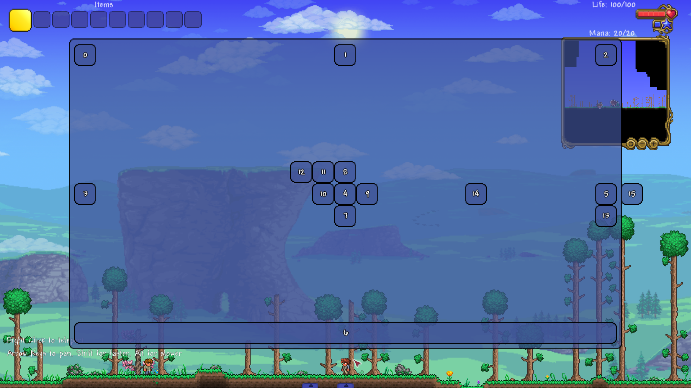

<h1 align="center">Класс <code>UIExCanvas</code></h1>

----

- Данная библиотека предполагает, что вы уже изучили [базовое руководство tModLoader по пользовательскому интерфейсу](https://github.com/tModLoader/tModLoader/wiki/Basic-UI-Element)<br>
- Данная статья предполагает, что вы изучили статью: [«структура стилей»](../Раздел-1/1.3-StyleStructure.md)
- Данная статья предполагает, что вы изучили статью: [«класс UIExLayout. Основы компоновки»](2.1-UIExLayout.md)

----
<br>

----

`UIExCanvas` - это контейнер компоновки, который располагает содержимым по заданным позициям (и не только).

----

<h2 align="center">Стили <code>UIExCanvas</code></h2>

`UIExCanvas` полноценно использует все стили `StyleLayoutContainer`.
- `Orientation`: определяет основную ось контейнера. Это значение играет роль при использовании `JustifyContent`, `JustifySelf`, `AlignItems`, `AlignSelf`.
- `JustifyContent` и `AlignContent` определяет изначальное выравнивание по главной / поперечной оси у всех вложенных элементов в контейнере. Эти два свойства играют важную роль при работе с `UIExCanvas`. Подробнее об этом будет ниже.

А так же использует `StyleLayoutChild` для вложенных элементов:
- `JustifySelf` и `AlignSelf` - переопределяют значения `JustifyContent` и `AlignContent` контейнера для каждого отдельного элемента.
- `Margin` работает стандартно.

----

Для `UIExCanvas` существует класс стиля `StyleLayoutContainerCanvas`:
```csharp
public class StyleLayoutContainerCanvas : IStyleLayoutContainer, IStyleCopyManager<StyleLayoutContainerCanvas>
{
    public bool AllowOverflow = false;
}
```
- `AllowOverflow` отвечает за то, могут ли элементы выйти за границу контейнера.
- Если значение `false` то контейнер будет сперва смещать элемент, а если этого недостаточно - ужимать размер вложенного элемента.
- У каждого вложенного элемента будет возможность переопределить данное значение отдельно.<br>

Получить данный класс стиля можно вызвав метод `Canvas()` у поля `StyeLayout`:
```csharp
UIExCanvas canvas = new();
StyleLayoutContainer style = canvas.StyleLayout;
StyleLayoutContainerCanvas styleCanvas = style.Canvas();
bool allowOverflow = styleCanvas.AllowOverflow;
```

----

Все вложенные в `UIExCanvas` элементы могут использовать стиль `StyleLayoutChildCanvas`.<br>
Чтобы вы могли использовать данный стиль, вам необходимо получить стиль `StyleLayoutChild` с помощью метода расширения `UIElement`: `StyleLayoutChild()`.<br>
Затем у полученного стиля вызвать метод `Canvas()`.
```csharp
UIElement element = new();
StyleLayoutChild style = element.StyleLayoutChild();
StyleLayoutChildCanvas styleCanvas = style.Canvas();
```
<br>

Сам класс `StyleLayoutChildCanvas` имеет следующую реализацию:
```csharp
public class StyleLayoutChildCanvas : IStyleLayoutChild, IStyleCopyManager<StyleLayoutChildCanvas>
{
    public StyleDimension Left = default(StyleDimension);
    public StyleDimension Top = default(StyleDimension);
    public StyleDimension Right = default(StyleDimension);
    public StyleDimension Bottom = default(StyleDimension);

    public bool? AllowOverflowSelf = null;
}
```

Как видно, данный класс реализует всего две вещи:
1. Добавляет смещение относительно выбранной координаты.
2. Добавляет`AllowOverflowSelf`. Данное значение, если оно отлично от `null` переопределяет значение `AllowOverflow` контейнера `UIExCanvas` для этого конкретного элемента.<br>

Пускай данный компоновщик выглядит довольно стандартно, в нем появляются важные нюансы, когда мы затрагиваем `JustifyContent`, `JustifySelf`, `AlignItems`, `AlignSelf`.<br>
Лучше будет сразу продемонстрировать на примере. Давайте представим 4 разные ситуации:<br>
1. У нас есть элемент, который **НЕ** использует данную библиотеку. И его значения `HAlign` и `VAlign`: `0.5f`. В этом случае данный элемент будет расположен по центру.
2. У нас есть элемент, вложенный в `UIExCanvas` со значениями `JustifySelf` и `AlignSelf`: `UIExAlignment.Start`, и значениями `StyleLayoutCanvas.Left.Precent = 0.5f`, `StyleLayoutCanvas.Top.Precent = 0.5f`. В этом случае результат будет аналогичен пункту 1.
3. У нас есть элемент, вложенный в `UIExCanvas` со значениями `JustifySelf` и `AlignSelf`: `UIExAlignment.Center`, и значениями `StyleLayoutCanvas.Left.Set(0f, 0f)`, `StyleLayoutCanvas.Top.Set(0f, 0f)`. В этом случае результат будет аналогичен пунктам 1 и 2.
4. У нас есть элемент, вложенный в `UIExCanvas` со значениями `JustifySelf` и `AlignSelf`: `UIExAlignment.Center`, и значениями `StyleLayoutCanvas.Left.Precent = 0.5f`, `StyleLayoutCanvas.Top.Precent = 0.5f`. В этом случае элемент **НЕ** будет расположен по центру. Он окажется ровно на 0.75% высоты и ширины контейнера.<br><br>

Почему в пункте 4 результат оказался таким?<br>
Все дело в том, что `Justify` и `Align` не просто выравнивают элемент. Они смещают стартовую точку отчета координат.<br>
В данном случае:
1. Элемент центрирован.
2. Стартовая точка координат центрирована.
3. `StyleLayoutCanvas.Left.Precent = 0.5f` - смещает элемент на 50% от его точки отсчета координат до правого края контейнера. Это будет 0.75% ширины контейнера.
4. Аналогично для `StyleLayoutCanvas.Top.Precent = 0.5f`<br>

Если сейчас это сложно для понимания, то станет куда проще и понятнее на разборе примера кода ниже.<br><br>

В отличии от стандартных инструментов **tModLoader** для расположения элементов по координатам `Left` и `Top`, данная библиотека предлагает использовать 4 координаты.
1. `Top`: смещение элемента относительн верхней части контейнера. Если значение 10px - элемент будет расположен на 10px ниже верней части контейнера.
2. `Left`: смещение элемента от относительно левой части контейнера.
3. `Bottom`: смещение элемента от относительно нижней части контейнера.
4. `Right`: смещение элемента от относительно правой части контейнера.

- `Top` и `Bottom` взаимно вычитают друг друга. Это значит: если `Top.Set(10f, 0f)` и `Bottom.Set(10f, 0f)` - то смещение элемент будет 0.
- Для `Left` и `Right` ситуация аналогичная.

----

<h2 align="center">Пример использования <code>UIExCanvas</code></h2>

<details>
<summary>Пример создания пользовательского интерфейса (без комментариев, разбор ниже)</summary>

```csharp
using Terraria.GameContent.UI.Elements;
using Terraria.ModLoader.UI;
using Terraria.UI;
using UIeXtenstion;
using UIeXtenstion.Enums;
using UIeXtenstion.Styles;

namespace UIeXtenstionExample;

public class ExampleMenuUI : UIExModSystem<ExamplePanelUI> { }

public class ExamplePanelUI : UIState
{
    // метод OnActivate() в данном случае используется только
    // для функции «горячей перезагрузки кода» в среде разработки.
    // для реального интерфейса правильнее было бы использовать
    // метод OnInitialize()
    public override void OnActivate()
    {
        RemoveAllChildren();

        UIPanel panel = new UIPanel();
        SetPrecentSizeCenter(0.8f, 0.8f, panel);

        UIExCanvas canvas = new UIExCanvas();
        canvas.Stretch();
        canvas.ShowLayoutLines = true;
        canvas.LayoutLinesThickness = 3f;
        canvas.LayoutLinesColor = Color.DarkOrange;

        canvas.StyleLayout.Set(
            orientation:        UIExOrientation.Horizontal,
            justifyContent:     UIExAlignment.Center);

        panel.Append(canvas);
        Append(panel);

        UIElement[] cubs = AddCubs(canvas, 50, 16);
        StyleLayoutChildCanvas[] stylesCanvas = new StyleLayoutChildCanvas[cubs.Length];
        StyleLayoutChild[] styles = new StyleLayoutChild[cubs.Length];

        for (int i = 0; i < cubs.Length; i++)
        {
            styles[i] = cubs[i].StyleLayoutChild();
            stylesCanvas[i] = styles[i].Canvas();
        }


        ////

        styles[0].Set(
            justifySelf:    UIExAlignment.Start, 
            alignSelf:      UIExAlignment.Start);

        // styles[1]: justifySelf == Auto == JustifyContent(canvas) == Center
        // styles[1]: alignSelf == Auto == AlignContent(canvas) == Auto == Start

        // styles[2]: alignSelf == Auto == AlignContent(canvas) == Auto == Start
        styles[2].Set(
            justifySelf:    UIExAlignment.End);
        
        styles[3].Set(
            justifySelf:    UIExAlignment.Start,
            alignSelf:      UIExAlignment.Center);

        // styles[4]: justifySelf == Auto == JustifyContent(canvas) == Center
        styles[4].Set(
            alignSelf:      UIExAlignment.Center);

        styles[5].Set(
            justifySelf:    UIExAlignment.End,
            alignSelf:      UIExAlignment.Center);
        
        styles[6].Set(
            justifySelf:    UIExAlignment.Stretch,
            alignSelf:      UIExAlignment.End,
            margin:         new UIExThickness(
                                pixels: true, 
                                right:   25f,
                                bottom: 50f,
                                left: 75f,
                                top: 100f));

        ////////////////
        ////////////////
        ////////////////

        CopyStyle4(indexStart: 7, indexEnd: 15);

        stylesCanvas[7].Top.Pixels = 50f;
        stylesCanvas[8].Bottom.Pixels = 50f;
        stylesCanvas[9].Left.Pixels = 50f;
        stylesCanvas[10].Right.Pixels = 50f;

        stylesCanvas[11].Bottom.Pixels = 50f;
        stylesCanvas[11].Right.Pixels = 50f;

        styles[12].Margin = new UIExThickness(
            pixels:     true,
            bottom:     50f,
            right:      100f);
        stylesCanvas[12].Left.Precent = -0.5f;

        stylesCanvas[13].Left.Pixels = 100000f;
        stylesCanvas[13].Top.Pixels = 50f;

        stylesCanvas[14].Left.Precent = 0.5f;

        stylesCanvas[15].Left.Precent = 1.1f;
        stylesCanvas[15].AllowOverflowSelf = true;

        void CopyStyle4(int indexStart, int indexEnd)
        {
            for (int i = indexStart; i <= indexEnd; i++)
                styles[i].Copy(styles[4]);
        }
    }

    public void SetPrecentSizeCenter(float width, float height, params UIElement[] elements)
    {
        foreach (var element in elements)
        {
            element.Width.Set(0f, width);
            element.Height.Set(0f, height);
            element.HAlign = 0.5f;
            element.VAlign = 0.5f;
        }
    }

    public UIElement[] AddCubs(UIElement element, params float[] pixelSizes)
    {
        int count = pixelSizes.Length;
        var panels = new UIElement[count];
        for (int i = 0; i < count; i++)
            panels[i] = AddCubs(element, pixelSizes[i], count: 1)[0];
        return panels;
    }

    public UIElement[] AddCubs(UIElement element, float pixelSize, int count = 1)
    {
        var panels = new UIElement[count];
        for (int i = 0; i < count; i++)
        {
            panels[i] = new UIButton<string>(i.ToString());
            panels[i].Width.Set(pixelSize, 0f);
            panels[i].Height.Set(pixelSize, 0f);
            element.Append(panels[i]);
        }
        return panels;
    }
}
```
</details>

<p align="center">
  
  <br>
  <em>Рис. 1.1. Визуальное отображения работы кода</em>
</p>

----

На изображении видно следующее:
1. Главная панель (размером в 80% экрана).
2. 16 пронумерованных кубов с одинаковыми ребрами 50px.

----

Немного о визуальных стилях. Это тема следующего раздела, но тут есть 1 важный момент для компоновщиков, поэтому данная сноска будет в каждой статье.<br>
Как видно, в данном коде система следующая: главная панель -> контейнер -> панели кубов.<br>
Для главной панели создается свой контейнер.<br>
Это излишне, если результат именно тот, которые мы хотим видеть на изображении.<br>
`UIExElement` (от которого наследуется `UIExLayout`) имеет свойство стиля: `StyleDisplay.tModLoaderStyle (bool)`.<br>
Если данное значение истинно, то визуальный элемент будет принимать соответствующий стиль **tModLoader**.<br>
Для `UIExElement` значение `true` приведет к тому, что стиль будет аналогичен `UIPanel`.<br>
Следовательно, наш код мог быть сокращен.<br><br>

Вот эту часть:
```csharp
UIPanel panel = new UIPanel();
SetPrecentSizeCenter(0.8f, 0.8f, panel);

UIExCanvas canvas = new UIExCanvas();

/*
...
*/

panel.Append(canvas);
Append(panel);
```

Можно заменить на следующую:
```csharp
UIExCanvas canvas = new UIExCanvas();
canvas.StyleDisplay.tModLoaderStyle = true;
SetPrecentSizeCenter(0.8f, 0.8f, panel);

/*
...
*/

Append(canvas);
```

Как видно во втором коде, элемент `UIPanel panel` исчез. Сам контейнер компоновки `canvas` стал одновременно главным контейнером.

----

Первое, что вы видите в коде:
```csharp
UIPanel panel = new UIPanel();
SetPrecentSizeCenter(0.8f, 0.8f, panel);
```

Это главная панель, которая будет добавлена в `UIState`. На ней будут располагаться `UIExCanvas`.<br><br>
`SetPrecentSizeCenter` - это вспомогательный метод, которого нет в самой библиотеке, и который определен ниже в этом же классе.
Он получает N `UIElement`, устанавливаем им переданную высоту и ширину и центрирует. В данном случае наша `panel` имеет размер: 80%х80% экрана.<br><br>

----

Далее в коде идет `UIExCanvas`:
```csharp
UIExCanvas canvas = new UIExCanvas();
canvas.Stretch();
canvas.ShowLayoutLines = true;
canvas.LayoutLinesThickness = 3f;
canvas.LayoutLinesColor = Color.DarkOrange;

canvas.StyleLayout.Set(
    orientation:        UIExOrientation.Horizontal,
    justifyContent:     UIExAlignment.Center);

panel.Append(canvas);
Append(panel);
```

- `canvas.Stretch();` - устанавливает размеры `canvas`: 100% от родительского элемента.
- Ниже мы добавляем `canvas` в главную панель `panel.Append(canvas);`, что означает, что `canvas` будет компоновать элементы по всей главной панели, т.е. по всему созданному интерфейсу.
- `canvas.ShowLayoutLines = true;` - указывает, что нужно отрисовать вспомогательные линии. Для `UIExCanvas` рисуется прямоугольник вокруг **внешней** области элементов. Более подробную информацию об областях элементов смотрите в первой части данного раздела. `canvas.LayoutLinesThickness = 3f;`- размер линий 3 пикселя. `canvas.LayoutLinesColor = Color.DarkOrange` - цвет вспомогательных линий.
- `Set` - это метод, который есть у любого класса стиля в библиотеке. Каждый Set стиля принимает значения для всех существующих полей класса стиля.
- Его стили `StyleLayoutContainer StyleLayout`:
  - `Orientation`: основная ось контейнера. `Horizontal` - горизонтальная.
  - `JustifyContent` (выравнивание элементов по основной оси) (основная ось - горизонтальная): `Center` - элементы выравниваются по центру ширины контейнера.
  - `AlignItems` (выравнивание элементов по поперечной оси) (поперечной ось - вертикальная): `не указано` - элементы выравниваются по верху контейнера.
- Его стили `StyleLayoutContainerCanvas StyleLayoutCanvas`:
  - `AllowOverflowSelf`: `не указано`. По умолчанию: `false`. Вложенные элементы не могут выйти за границы контейнера.

----

Далее в коде идет процесс создания 16 кубов 50x50px и сохранение их стилей:
```csharp
UIElement[] cubs = AddCubs(canvas, 50, 16);
StyleLayoutChildCanvas[] stylesCanvas = new StyleLayoutChildCanvas[cubs.Length];
StyleLayoutChild[] styles = new StyleLayoutChild[cubs.Length];

for (int i = 0; i < cubs.Length; i++)
{
    styles[i] = cubs[i].StyleLayoutChild();
    stylesCanvas[i] = styles[i].Canvas();
}
```

Кубы добавляются с помощью метода `AddCubs`:
```csharp
public UIElement[] AddCubs(UIElement element, params float[] pixelSizes)
{
    int count = pixelSizes.Length;
    var panels = new UIElement[count];
    for (int i = 0; i < count; i++)
        panels[i] = AddCubs(element, pixelSizes[i], count: 1)[0];
    return panels;
}

public UIElement[] AddCubs(UIElement element, float pixelSize, int count = 1)
{
    var panels = new UIElement[count];
    for (int i = 0; i < count; i++)
    {
        panels[i] = new UIPanel();
        panels[i].Width.Set(pixelSize, 0f);
        panels[i].Height.Set(pixelSize, 0f);
        element.Append(panels[i]);
    }
    return panels;
}
```
Данные методы также созданы специально для данного примера и не существуют в самой библиотеке.<br>

----

Далее идет код, который задает значения стиля вложенным кубам:<br>
Выравнивание кубов 0-6:<br>
`0`: верх по горизонтали; лево по вертикали;<br>
`1`: верх по горизонтали; центр по вертикали;<br>
`2`: верх по горизонтали; право по вертикали;<br>
`3`: лево по горизонтали; центр по вертикали;<br>
`4`: по центру экрана;<br>
`5`: право по горизонтали; центр по вертикали;<br>
`6`: растянут по горизонтали (с отступами); низ по вертикали.<br>
```csharp
styles[0].Set(
    justifySelf:    UIExAlignment.Start, 
    alignSelf:      UIExAlignment.Start);

// styles[1]: justifySelf == Auto == JustifyContent(canvas) == Center
// styles[1]: alignSelf == Auto == AlignContent(canvas) == Auto == Start

// styles[2]: alignSelf == Auto == AlignContent(canvas) == Auto == Start
styles[2].Set(
    justifySelf:    UIExAlignment.End);

styles[3].Set(
    justifySelf:    UIExAlignment.Start,
    alignSelf:      UIExAlignment.Center);

// styles[4]: justifySelf == Auto == JustifyContent(canvas) == Center
styles[4].Set(
    alignSelf:      UIExAlignment.Center);

styles[5].Set(
    justifySelf:    UIExAlignment.End,
    alignSelf:      UIExAlignment.Center);

styles[6].Set(
    justifySelf:    UIExAlignment.Stretch,
    alignSelf:      UIExAlignment.End,
    margin:         new UIExThickness(
                        pixels: true, 
                        right:   25f,
                        bottom: 50f,
                        left: 75f,
                        top: 100f));
```

Как видно, часть строк закомментированы:<br>
- Для `styles[1]`, `styles[2]`, `style[4]`. Это сделано, чтобы показать, какие значения для этих полей им нужны были бы, но они уже установлены у самого `UIExCanvas canvas`.
- Например: элемент 2 (`style[2]`) располагается: центр по горизонтали; верх по вертикали. Чтобы получить это выравнивание с помощью `JustifySelf` и `AlignSelf` ему нужно выставить:
  -  `JustifySelf = UIExAlignment.Center` (выравнивание по основной оси. Основная ось у `canvas` указана как горизонтальная). Центр по горизонтали.
  -  `AlignSelf = UIExAlignment.Start` (выравнивание по поперечной оси). Верх по вертикали.
  -  У `canvas` поле `JustifyContent` уже установлено на `UIExAlignment.Center`, которое смещает данный элемент. Свойство `JustifySelf` не имеет смысл устанавливать.
  -  У `canvas` поле `AlignItems` не установлена. По умолчанию: `UIExAlignment.Auto` (аналогично `UIExAlignment.Start`). Свойство `AlignSelf` не имеет смысл устанавливать.<br>

----

У элемента 6 (`style[6]`) поле `justifySellf == UIExAlignment.Stretch`. Это означает, что оно растягивается по всему размеру главной оси. В данном случае - по всей ширине, кроме отступа `Margin`.<br><br>
Это один из двух элементов, у которого вспомогательные линии не совпадают с реальным элементов. И главную роль тут играет `Margin`.<br>

`Margin` увеличивает внешнюю область элемента. Подробнее об этом читайте в статье «*Класс UIExLayout. Основы компоновки*».<br>
Внешний размер определяется следующим образом:
1. `outer-Top`: `cubs[6].Top - styles[6].Margin.Top;`
2. `outer-Left`: `cubs[6].Left - styles[6].Margin.Left;`
3. `outer-Width`: `cubs[6].Width + styles[6].Margin.Left + styles[6].Margin.Right;`
4. `outer-Height`: `cubs[6].Height + styles[6].Margin.Top + styles[6].Margin.Bottom;`<br>

- `cubs[6].Left` == `Margin.Left`, если к он растянут по ширине.
- `cubs[6].Width` == `ширина контейнера - (Margin.Left + Margin.Right)`, если он растянут по ширине.<br>

Результат (предварительный): (`c50px` - условное обозначение размер не растянутого ребра куба (размер: `50px`))
1. `outer-Top`: `высота контейнера - c50px - 100px`
2. `outer-Left`: `75px - 75px;`
3. `outer-Width`: `(ширина контейнера - (Margin.Left + Margin.Right)) + 75px + 25px;`
4. `outer-Height`: `c50px + 100px + 50px;`<br>

Результат (окончательный):
1. `outer-Top`: `высота контейнера - 150px`
2. `outer-Left`: `0px;`
3. `outer-Width`: `150px;`
4. `outer-Height`: `200px;`<br>

`Stretch` растягивает внешнюю область элемента. А обычная область (которая и отображается на экране) **после** растягивания вычисляется по формуле:<br>
Формулы для расчета позиций при растягивании (`Left`, `Width` - по ширине; `Top`, `Height` - по высоте):
1. `Left = Margin.Left;`
2. `Top = Margin.Top;`
3. `Width = ширина контейнера - (Margin.Left + Margin.Right)`.
4. `Height = высота контейнера - (Margin.Top + Margin.Bottom)`.

----

Далее идет метод:
```csharp
CopyStyle4(indexStart: 7, indexEnd: 15); 
```
Это внутренний вспомогательный метод. Он просто копирует значения `style[4]` (`justifySelf: center, alignSelf: center`) в стили для 7-15 элементов.<br><br>

Далее:
```csharp
stylesCanvas[7].Top.Pixels = 50f;
stylesCanvas[8].Bottom.Pixels = 50f;
stylesCanvas[9].Left.Pixels = 50f;
stylesCanvas[10].Right.Pixels = 50f;

stylesCanvas[11].Bottom.Pixels = 50f;
stylesCanvas[11].Right.Pixels = 50f;
```
Все эти элементы (как и все последующие) скопировали значения `style[4]` и отсчет их координат начинаются с центра контейнера.
1. Элемент 7 смещен на 50px вниз относительно центра и располагается ниже центрального элемента 4.
2. Элемент 8 смещен на 50px вверх относительно центра и располагается выше центрального элемента 4.
3. Элемент 9 смещен на 50px вправо относительно центра и располагается правее центрального элемента 4.
4. Элемент 10 смещен на 50px влево относительно центра и располагается левее центрального элемента 4.
5. Элемент 11 смещен на 50px вверх и влево относительно центра и располагается выше и левее центрального элемента 4.<br><br>

Далее:
```csharp
styles[12].Margin = new UIExThickness(
    pixels:     true,
    bottom:     50f,
    right:      100f);
stylesCanvas[12].Left.Precent = -0.5f;
```

Это пример демонстрирует:
1. Дополнительную визуализацию использования `Margin`. Как видно на изображении у элемента 12 увеличена внешняя область, но сам он находится в ее левой-верхней части. Если бы вместо right, bottom мы указали бы left/top - элемент при этом сместился бы. Так как компоновщик устанавливает позиции верхней-левой точки **внешнего размера** элемента.
2. Позицию указанную в процентах и которая является отрицательной. Данный элемент центрирован, поэтому -0.5f сместит элемент вправо на 25% контейнера (50% от центрированной точки отсчета координат до левого края контейнера). Подробнее будет в разбора куба с индексом 14.

```csharp
styles[12].Bottom.Pixels = 50f;
styles[12].Right.Pixels = 100f;
```
В сущности: у этих двух способов расположения элементов есть важнейшее отличие:<br>
- `Left`, `Top`, `Right`, `Bottom` - это простое смещение элемента.<br>
- `Margin` - это смещение и увеличение внешнего размера элемента.<br>
Для данного компоновщика это имеет значение, только если `JustifyContent/Self` и/или `AlignItems/Self` имеют значение `UIExAlignment.Stretch`.<br>
Для всех прочих настроек нет никакой разницы, что именно использовать для смещения.<br>

Как можно заметить, в отличии от всех прочих элементов, у элемента 6 и 12 вспомогательный прямоугольник нарисован с отступом.<br>
Данная обводка рисуется вокруг внешнего размера элемента.<br>
Кроме того, если бы мы попробовали для элемента 6 задать `Left` или `Right` значения - мы бы не увидели никакого смещения, при (`AllowOverflow == false && AllowOverflowSelf != true`).<br>


----

Далее куб 13. Его мы разберем вместе с 15. А сейчас переходим к 14:
```csharp
stylesCanvas[14].Left.Precent = 0.5f;
```
Если бы мы не использовали данную библиотеку, написали бы: `HAlign = 0.5f` - элемент сместился бы на 50% от размера родительского элемента, минус 50% своего размера.<br>
Но на изображении данный куб расположен на 75% ширины.<br>
Так как `JustifySelf == UIExAlignment.Center`, точка отсчета начинается с центра контейнера.<br>
Значит, что `stylesCanvas[14].Left.Precent = 0.5f;` считает 50% от размера между центров и правым краем контейнера.

----

И последние 2 куба, которые мы не разбирали:
```csharp
stylesCanvas[13].Left.Pixels = 100000f;
stylesCanvas[13].Top.Pixels = 50f;

stylesCanvas[15].Left.Precent = 1.1f;
stylesCanvas[15].AllowOverflowSelf = true;
```
В первом случае видно, что смещение установлено на 100 тысяч пикселей.<br>
Тем не менее, его значение `AllowOverflowSelf == false`. Это значит, что контейнер контролирует, чтобы элемент не вышел за его границу.<br>
На изображение вы можете его наблюдать прижатым к правому краю.<br><br>

А вот следующий элемент имеет левое смещение на 110% (от разницы между центром и правым краем).<br>
И значение `AllowOverflowSelf == true`. Контейнер не контролирует то, выходит ли элемент за его границу.<br>
Поэтому вы можете увидеть данный элемент справа от границы контейнера.


----

<table align="center" width="100%">
  <tr>
    <td align="left"><b>Предыдущая часть:</b></td>
    <td align="left">
      <a 
        href="2.1-UIExLayout.md">
        Раздел II: Элементы компоновки. Часть 1: «UIExLayout»
      </a>
    </td>
  </tr>
  <tr>
    <td align="left"><b>Следующая часть:</b></td>
    <td align="left">
      <a 
        href="2.3-UIExStackPanel.md">
        Раздел II: Элементы компоновки. Часть 3: «UIExStackPanel»
      </a>
    </td>
  </tr>
  <tr>
    <td align="left"><b>Содержание:</b></td>
    <td align="left"><a href="../README.md">Перейти к оглавлению</a></td>
  </tr>
</table>
