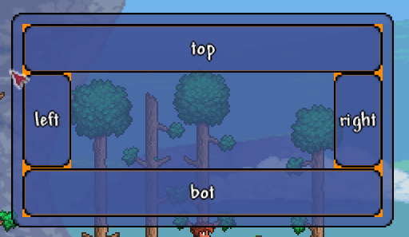
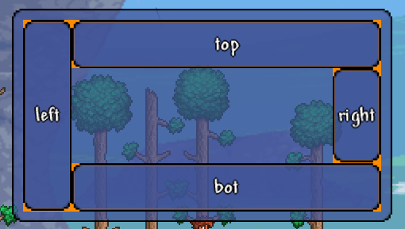
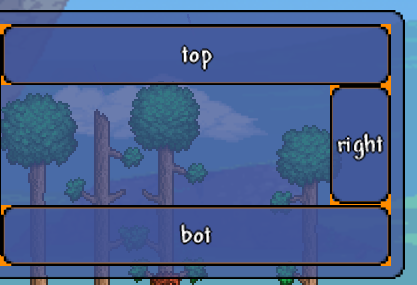
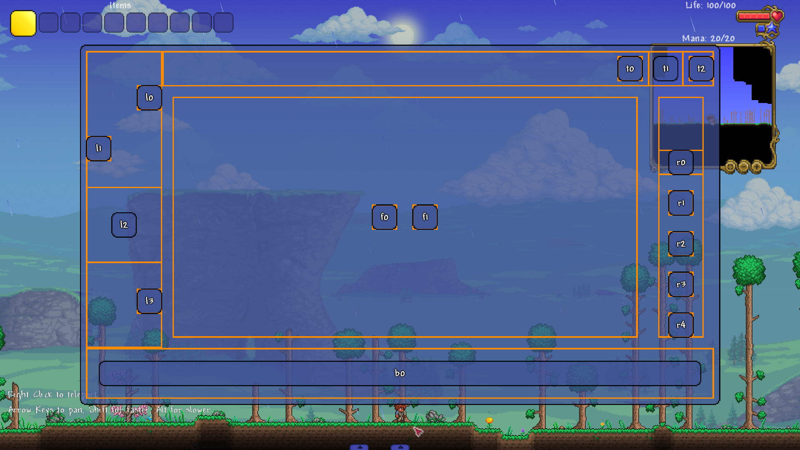

<h1 align="center">Класс <code>UIExDockPanel</code></h1>

----

- Данная библиотека предполагает, что вы уже изучили [базовое руководство tModLoader по пользовательскому интерфейсу](https://github.com/tModLoader/tModLoader/wiki/Basic-UI-Element)<br>
- Данная статья предполагает, что вы изучили статью: [«структура стилей»](../Раздел-1/1.3-StyleStructure.md)
- Данная статья предполагает, что вы изучили статью: [«класс UIExLayout. Основы компоновки»](2.1-UIExLayout.md)
- Данная статья предполагает, что вы изучили статью: [«класс UIExStackPanel»](2.3-UIExStackPanel.md)

----
<br>

----

`UIExDockPanel` - это контейнер компоновки, который **последовательно** пристыковывает дочерние элементы к одной из четырех сторон доступной области:
- `Left`
- `Right`
- `Top`
- `Bottom`<br>

<p align="center">
  
  <br>
  <em>Рис. 1.1. Пример использования <code>UIExDockPanel</code></em>
</p>

----

Каждому элементу (кроме 1-го исключения, о котором позже) мы указываем сторону, к которой его хотим пристыковать.<br>
Но ключевое значение при работе с данным компоновщиком имеет порядок добавления элементов в контейнер.<br>

Допустим у нас есть 4 кнопки, которые мы пристыковали к стороне по соотношению с названием кнопки и добавили в компоновщик в следующем порядке:
1. `buttonTop`.
2. `buttonBottom`
3. `buttonLeft`
4. `buttonRight`<br>

Результат этого вы наблюдали на изображении выше.<br>

Но теперь изменим порядок добавления. Сами кнопки останутся пристыкованными к тем же сторонам, но вот порядок их добавления в контейнер будет следующим:
1. `buttonLeft`
2. `buttonTop`.
3. `buttonBottom`
5. `buttonRight`<br>

От такой смены порядка добавления элементов мы увидим следующий результат:

<p align="center">
  
  <br>
  <em>Рис. 1.2. Результат после смены порядка добавления элементов</em>
</p>

----

Компоновщик делает следующее:
1. Запоминает, к какой из сторон был пристыкован первый элемент; второй элемент и т.д. Например:
   - первый - к левой стороне;
   - второй - к левой стороне;
   - третий - к правой стороне;
   - четвертый - к левой стороне;
   - пятый - к нижней стороне.
2. Запоминает список сторон без повторений в том же порядке. Пример (по п.1):
   - левая сторона;
   - правая сторона;
   - нижняя сторона.
3. Поочередно выделяет размер каждой из сторон исходя списка п.2 и алгоритма ниже.<br>

Размеры стороны определяются следующим образом:
1. Высота сторон `Left` и `Right`: высота свободного места в контейнере.
2. Ширина сторон `Left` и `Right`: ширина самой большой внешней области из пристыкованный к этой стороне элементов.
3. Высота сторон `Top` и `Bottom`: ширина свободного места в контейнере.
4. Высота сторон `Top` и `Bottom`: высота самой большой внешней области из пристыкованный к этой стороне элементов.<br>

После того, как область первой добавленной стороны рассчитана, данная область вырезается из свободного пространства контейнера.<br>
В примере из прошлого изображения первой добавлялась кнопка пристыкованная к левой стороне.<br>
Вот так свободная область выглядит для `UIExDockPanel` после добавления первой (левой) стороны:

<p align="center">
  
  <br>
  <em>Рис. 1.3. Размер свободной области после добавления левой стороны</em>
</p>

----

Вы можете взять код ниже и изменять порядок добавления элементов, чтобы посмотреть на результат.<br>
Старайтесь при этом предсказывать, как это результат будет выглядеть.<br>
Вам не нужно в данный момент понимать, что делает этот код в целом. Вам важны лишь строки, отвечающие за порядок добавления элементов:
```csharp
UIButton<string> buttonTop = CreateAndAddUIBottom(dockPanel, 50f, "top");
UIButton<string> buttonBottom = CreateAndAddUIBottom(dockPanel, 50f, "bot");
UIButton<string> buttonLeft = CreateAndAddUIBottom(dockPanel, 50f, "left");
UIButton<string> buttonRight = CreateAndAddUIBottom(dockPanel, 50f, "right");
```

Метод `CreateAndAddUIBottom` создает кнопку и сразу добавляет ее в `UIExDockPanel`.<br>
Меняйте порядок данных строк для изменения результата.<br>

<details>
<summary>Код, результат которого вы видели на рис. 1.1</summary>
  
```csharp
using Microsoft.Xna.Framework;
using Terraria.GameContent.UI.Elements;
using Terraria.ModLoader.UI;
using Terraria.UI;
using UIeXtenstion;
using UIeXtenstion.Enums;
using UIeXtenstion.Styles;

namespace UIeXtenstionExample;

public class ExampleMenuUI : UIExModSystem<ExamplePanelUI> { }

public class ExamplePanelUI : UIState
{
    // метод OnActivate() в данном случае используется только
    // для функции «горячей перезагрузки кода» в среде разработки.
    // для реального интерфейса правильнее было бы использовать
    // метод OnInitialize()
    public override void OnActivate()
    {
        RemoveAllChildren();

        UIPanel panel = new UIPanel();
        SetPrecentSizeCenter(0.25f, 0.25f, panel);

        UIExDockPanel dockPanel = new();
        dockPanel.Stretch();
        dockPanel.SetLayoutLinesInfoForBranch(
            state:      true,
            thickness:  3f,
            color:      Color.DarkOrange);

        dockPanel.StyleLayout.JustifyContent = UIExAlignment.Stretch;
        dockPanel.StyleLayout.AlignItems = UIExAlignment.Stretch;

        UIButton<string> buttonTop = CreateAndAddUIBottom(dockPanel, 50f, "top");
        UIButton<string> buttonBottom = CreateAndAddUIBottom(dockPanel, 50f, "bot");
		UIButton<string> buttonLeft = CreateAndAddUIBottom(dockPanel, 50f, "left");
        UIButton<string> buttonRight = CreateAndAddUIBottom(dockPanel, 50f, "right");

        var btTopStyleDock = buttonTop.StyleLayoutChild().DockPanel();
        var btBottomStyleDock = buttonBottom.StyleLayoutChild().DockPanel();
        var btLeftStyleDock = buttonLeft.StyleLayoutChild().DockPanel();
        var btRightStyleDock = buttonRight.StyleLayoutChild().DockPanel();

        btTopStyleDock.Side = UIExSide.Top;
        btBottomStyleDock.Side = UIExSide.Bottom;
        btLeftStyleDock.Side = UIExSide.Left;
        btRightStyleDock.Side = UIExSide.Right;

        ///////////////////

        panel.Append(dockPanel);
        Append(panel);
    }

    public void SetPrecentSizeCenter(float width, float height, params UIElement[] elements)
    {
        foreach (var element in elements)
        {
            element.Width.Set(0f, width);
            element.Height.Set(0f, height);
            element.HAlign = 0.5f;
            element.VAlign = 0.5f;
        }
    }

    public UIButton<string> CreateAndAddUIBottom(UIExLayout layout, float pixelsSize, string text)
    {
        UIButton<string> button = new(text);
        button.Width.Pixels = pixelsSize;
        button.Height.Pixels = pixelsSize;
        layout.Append(button);
        return button;
    }
}
```
</details>

----

`UIExDockPanel` также имеет «сторону» `Fill`. Это пространство, которое занимает всю оставшуюся область после высчитывания сторон `Left`, `Right`, `Top`, `Bottom`.<br>
Пример того, как это выглядит вы можете посмотреть ниже.<br>
Элементы, отмеченные как занимающие сторону `Fill` не имеют значения в порядке добавления таких элементов в контейнер и не зависит от размера пристыкованных элементов.<br>
Сторона для `Fill` в любом случае будет выделена последнюю очередь и займет всю оставшуюся область.<br>

----

<h2 align="center"><code>UIExStackPanel</code></h2>

В начале главы было предупреждение о том, что данная статья рассчитана на то, что вы уже изучили элемент компоновки `UIExStackPanel`. И у этого есть важная причина.<br>

Фактически, все элементы в каждой стороне компонуются практически по тому же принципу, что и элементы внутри `UIExStackPanel`.<br>
Меняются лишь способы задавания параметров каждой отдельной стороне.

----

<h2 align="center">Стили <code>UIExDockPanel</code></h2>

Базовый стиль компоновки элементов StyleLayoutContainer:
```csharp
public partial class StyleLayoutContainer : IStyleLayoutContainer, IStyleCopy<StyleLayoutContainer>
{
    public Enums.UIExOrientation Orientation = Enums.UIExOrientation.Vertical;
    public Enums.UIExAlignment JustifyContent = Enums.UIExAlignment.Auto;
    public Enums.UIExAlignment AlignItems = Enums.UIExAlignment.Auto;
}
```

- `Orientation`: определяет главную ось **FILL** стороны, по которой будут выравниваться элементы внутри нее.
  - Для сторон `Left` и `Right` ориентация всегда вертикальная.
  - Для сторон `Top` и `Bottom` ориентация всегда горизонтальная.
- `JustifyContent`: выравнивание элементов по главной оси (работает для всех сторон; можно переопределить данное значение для конкретной стороны и/или конкретного элемента).
- `AlignItems`: выравнивание элементов по поперечной оси (работает для всех сторон; можно переопределить данное значение для конкретной стороны и/или конкретного элемента).<br>

Типы выравнивания:
```csharp
public enum UIExAlignment : byte
{
    Auto,
    Start,
    Center,
    End,
    Stretch
}
```

- `Auto`: аналогично `Start`. Используется у вложенных элементов и/или сторон.
- `Start`: выравнивание элементов по старту оси стороны(верх/лево).
- `Center`: выравнивание элементов по центру оси стороны.
- `End`: выравнивание элементов по концу оси стороны (низ/право).
- `Stretch`: растягивание элемента по всей оси стороны (за вычетом `Margin`).

----

Базовые стили дочерних элементов `StyleLayoutChild`:
```csharp
public partial class StyleLayoutChild : IStyleLayoutChild, IStyleCopy<StyleLayoutChild>
{
    public Enums.UIExAlignment JustifySelf = Enums.UIExAlignment.Auto;
    public Enums.UIExAlignment AlignSelf = Enums.UIExAlignment.Auto;
    public UIExThickness Margin = new();
}
```
Поле `JustifySelf` у дочерних элементов любые значения, кроме значения `Stretch` будут игнорироваться. Значение `Auto` означает, что значение будет управляться контейнером/стороной.
Поле `AlignSelf` переопределяет значение `AlignContent` для конкретного вложенного элемента. Значение `Auto` означает, что значение будет управляться контейнером/стороной.
Поле `Margin` работает полноценно (также учитывается при определении размера стороны).

----

Для класса `UIExDockPanel` используется класс стилей: `StyleLayoutContainerDockPanel`, которое хранит все стили компоновки для данного класса:
```csharp
public class StyleLayoutContainerDockPanel : IStyleLayoutContainer, IStyleCopy<StyleLayoutContainerDockPanel>
{
    public SideStyle SideLeft;
    public SideStyle SideRight;
    public SideStyle SideTop;
    public SideStyle SideBottom;
    public SideStyle SideFill;
}
```
Данный класс стиля содержит стили четырех сторон и для заполнения свободного пространства.

```csharp
public class SideStyle : IStyleCopy<SideStyle>
{
    public UIExThickness Padding = default(UIExThickness);
    public Enums.UIExAlignment JustifyContent = Enums.UIExAlignment.Auto;
    public Enums.UIExAlignment AlignItems = Enums.UIExAlignment.Auto;
    public StyleDimension Spacing = default(StyleDimension);
    public bool Reverse = false;
}
```

- `Padding`: отступы от краев стороны до выделенного места для расположения элементов внутри стороны.
- `JustifyContent`: выравнивание элементов по главной оси. Переопределяет значение `JustifyContent` класса стиля контейнера для этой конкретной стороны. Значение `Auto` означает, что значение будет управляться контейнером.
- `AlignItems`: выравнивание элементов по главной оси. Переопределяет значение `AlignItems` класса стиля контейнера для этой конкретной стороны. Значение `Auto` означает, что значение будет управляться контейнером.
- `Spacing`: отвечает за пространство между элементами внутри стороны (пространство между элементами по главной оси).
- `Reverse`: указывает на то, что элементы данной стороны должны располагаться в реверсивном порядке.<br>

Для получения стиля `UIExDockPanel` используйте метод `DockPanel()` у поля `StyleLayout`:
```csharp
UIExDockPanel dockPanel = new();

StyleLayoutContainer styleLayout = dockPanel.StyleLayout;
StyleLayoutContainerDockPanel styleLayoutDockPanel = styleLayout.DockPanel();

styleLayoutDockPanel.SideLeft.Reverse = true;
```

----

Стиль дочерних элементов `UIExDockPanel`:
```csharp
public class StyleLayoutChildDockPanel : IStyleLayoutChild, IStyleCopy<StyleLayoutChildDockPanel>
{
    public Enums.UIExSide Side = Enums.UIExSide.Left;
}

public enum UIExSide : byte
{
    Left,
    Right,
    Top,
    Bottom,
    Fill
}
```
Как видно стиль дочерних элементов отвечает только за то, к какой стороне элемент нужно пристыковать.<br>

Чтобы получить базовый стиль дочерних элементов используйте метод расширения `UIElement`: `StyleLayoutChild()`.<br>
Чтобы получить стиль дочерних элементов с параметрами для `UIExDockPanel` вызовите метод `DockPanel()` у базового стиля:
```csharp
UIElement element = new();

StyleLayoutChild style = element.StyleLayoutChild();
StyleLayoutChildDockPanel styleDockPanel = style.DockPanel();

styleDockPanel.Side = UIExSide.Top;
```

----

<h2 align="center">Пример использования <i>UIExStackPanel</i></h2>

<details>
<summary>Пример создания пользовательского интерфейса (без комментариев, разбор ниже)</summary>

```csharp
using Microsoft.Xna.Framework;
using System;
using Terraria.GameContent.UI.Elements;
using Terraria.ModLoader.UI;
using Terraria.UI;
using UIeXtenstion;
using UIeXtenstion.Enums;
using UIeXtenstion.Styles;

namespace UIeXtenstionExample;

public class ExampleMenuUI : UIExModSystem<ExamplePanelUI> { }

public class ExamplePanelUI : UIState
{
    // метод OnActivate() в данном случае используется только
    // для функции «горячей перезагрузки кода» в среде разработки.
    // для реального интерфейса правильнее было бы использовать
    // метод OnInitialize()
    public override void OnActivate()
    {
        RemoveAllChildren();

        UIPanel panel = new UIPanel();
        SetPrecentSizeCenter(0.8f, 0.8f, panel);

        UIExDockPanel dockPanel = new UIExDockPanel();
		dockPanel.Stretch();

        dockPanel.ShowLayoutLines = true;
        dockPanel.LayoutLinesThickness = 3f;
        dockPanel.LayoutLinesColor = Color.DarkOrange;

        StyleLayoutContainer styleLayout = dockPanel.StyleLayout;
        StyleLayoutContainerDockPanel styleLayoutDock = styleLayout.DockPanel();

        styleLayout.JustifyContent = UIExAlignment.Center;
        styleLayout.AlignItems = UIExAlignment.Center;

        ////////////////

        SideStyle sideBottom = styleLayoutDock.SideBottom;
        sideBottom.Spacing.Pixels = 100f;

        UIElement[] cubsBottom = AddCubs(dockPanel, "b", pixelSize: 50f, 1);
        StyleLayoutChild[] cubsStylesBottom = new StyleLayoutChild[cubsBottom.Length];
        StyleLayoutChildDockPanel[] cubsStylesDockBottom = new StyleLayoutChildDockPanel[cubsBottom.Length];

        for (int i = 0; i < cubsBottom.Length; i++)
        {
            cubsStylesBottom[i] = cubsBottom[i].StyleLayoutChild();
            cubsStylesDockBottom[i] = cubsStylesBottom[i].DockPanel();
            cubsStylesDockBottom[i].Side = UIExSide.Bottom;
        }

        cubsStylesBottom[0].Margin = new(pixels: true, size: 25f);
        cubsStylesBottom[0].JustifySelf = UIExAlignment.Stretch;

        ////////////////

        SideStyle sideLeft = styleLayoutDock.SideLeft;
        sideLeft.Spacing.Pixels = 50f;
        sideLeft.AlignItems = UIExAlignment.End;

        UIElement[] cubsLeft = AddCubs(dockPanel, "l", pixelSize: 50f, 4);
        StyleLayoutChild[] cubsStylesLeft = new StyleLayoutChild[cubsLeft.Length];
        StyleLayoutChildDockPanel[] cubsStylesDockLeft = new StyleLayoutChildDockPanel[cubsLeft.Length];

        for (int i = 0; i < cubsLeft.Length; i++)
        {
            cubsStylesLeft[i] = cubsLeft[i].StyleLayoutChild();
            cubsStylesDockLeft[i] = cubsStylesLeft[i].DockPanel();
            cubsStylesDockLeft[i].Side = UIExSide.Left;
        }

        cubsStylesLeft[1].AlignSelf = UIExAlignment.Start;
        cubsStylesLeft[2].Margin = new(pixels: true, 50f);

        /////////////////

        SideStyle sideTop = styleLayoutDock.SideTop;
        sideTop.Spacing.Pixels = 10f;
        sideTop.JustifyContent = UIExAlignment.End;

        UIElement[] cubsTop = AddCubs(dockPanel, "t", pixelSize: 50f, 3);
        StyleLayoutChild[] cubsStylesTop = new StyleLayoutChild[cubsTop.Length];
        StyleLayoutChildDockPanel[] cubsStylesDockTop = new StyleLayoutChildDockPanel[cubsTop.Length];

        for (int i = 0; i < cubsTop.Length; i++)
        {
            cubsStylesTop[i] = cubsTop[i].StyleLayoutChild();
            cubsStylesDockTop[i] = cubsStylesTop[i].DockPanel();
            cubsStylesDockTop[i].Side = UIExSide.Top;
        }

        cubsStylesTop[1].Margin = new(pixels: true, 10f);

        /////////////////

        SideStyle sideRight = styleLayoutDock.SideRight;
        sideRight.Spacing.Pixels = 30f;
        sideRight.JustifyContent = UIExAlignment.End;
        sideRight.Padding = new UIExThickness(pixels: true, size: 20f);

        UIElement[] cubsRight = AddCubs(dockPanel, "r", pixelSize: 50f, 5);
        StyleLayoutChild[] cubsStylesRight = new StyleLayoutChild[cubsRight.Length];
        StyleLayoutChildDockPanel[] cubsStylesDockRight = new StyleLayoutChildDockPanel[cubsRight.Length];

        for (int i = 0; i < cubsRight.Length; i++)
        {
            cubsStylesRight[i] = cubsRight[i].StyleLayoutChild();
            cubsStylesDockRight[i] = cubsStylesRight[i].DockPanel();
            cubsStylesDockRight[i].Side = UIExSide.Right;
        }

        cubsStylesRight[0].Margin = new(pixels: true, left: 20f, right: 20f);

        /////////////////

        styleLayout.Orientation = UIExOrientation.Horizontal;

        SideStyle fillRight = styleLayoutDock.SideFill;
        fillRight.Spacing.Pixels = 30f;
        fillRight.JustifyContent = UIExAlignment.Center;
        fillRight.Padding = new UIExThickness(pixels: true, size: 20f);

        UIElement[] cubsFill = AddCubs(dockPanel, "f", pixelSize: 50f, 2);
        StyleLayoutChild[] cubsStylesFill = new StyleLayoutChild[cubsFill.Length];
        StyleLayoutChildDockPanel[] cubsStylesDockFill = new StyleLayoutChildDockPanel[cubsFill.Length];

        for (int i = 0; i < cubsFill.Length; i++)
        {
            cubsStylesFill[i] = cubsFill[i].StyleLayoutChild();
            cubsStylesDockFill[i] = cubsStylesFill[i].DockPanel();
            cubsStylesDockFill[i].Side = UIExSide.Fill;
        }

        ///////////////////

        panel.Append(dockPanel);
        Append(panel);
    }

    public void SetPrecentSizeCenter(float width, float height, params UIElement[] elements)
    {
        foreach (var element in elements)
        {
            element.Width.Set(0f, width);
            element.Height.Set(0f, height);
            element.HAlign = 0.5f;
            element.VAlign = 0.5f;
        }
    }

    public UIElement[] AddCubs(UIElement element, string prefix, params float[] pixelSizes)
    {
        int count = pixelSizes.Length;
        var panels = new UIElement[count];
        for (int i = 0; i < count; i++)
            panels[i] = AddCubs(element, prefix, pixelSizes[i], count: 1)[0];
        return panels;
    }

    public UIElement[] AddCubs(UIElement element, string prefix, float pixelSize, int count = 1)
    {
        var panels = new UIElement[count];
        for (int i = 0; i < count; i++)
        {
            panels[i] = new UIButton<string>($"{prefix}{i}");
            panels[i].Width.Set(pixelSize, 0f);
            panels[i].Height.Set(pixelSize, 0f);
            element.Append(panels[i]);
        }
        return panels;
    }
}
```

</details>

<p align="center">
  
  <br>
  <em>Рис. 1.4. Визуальное отображения работы кода</em>
</p>

----

Первое, что хочется повторить: порядок добавления элементов.<br>
В данном коде в `UIExDockPanel` добавлялись:
1. 1 элемент со значение `Side == UIExSide.Bottom;`
2. 4 элемента со значение `Side == UIExSide.Left;`
3. 3 элемента со значение `Side == UIExSide.Top;`
4. 5 элементов со значение `Side == UIExSide.Right;`
5. 1 элемент со значение `Side == UIExSide.Fill;`

Это значит, что стороны вычисляются следующим образом:
1. Нижняя сторона занимает: 100% ширины `dockPanel` и 100% максимальной высоты внешней области элемента пристыкованного к нижней стороне.
2. Левая сторона занимает: (100% высоты `dockPanel` - высота нижней стороны) и 100% максимальной ширины внешней области элемента пристыкованного к левой стороне.
3. Верхняя сторона занимает: (100% ширины `dockPanel` - ширина левой стороны) и 100% максимальной высоты внешней области элемента пристыкованного к верхней стороне.
4. Правая сторона занимает: (100% высоты `dockPanel` - высота нижней стороны - высота верхней стороны) и 100% максимальной ширины внутренней области элемента пристыкованного к правой стороне.
5. `Fill` заполняет все оставшееся пространство.
Это области самих сторон.<br>
Элементы компонуются по внутренней области сторон (после вычета `padding` сторон).<br>

----

Первое, что видно в коде:
```csharp
UIPanel panel = new UIPanel();
SetPrecentSizeCenter(0.8f, 0.8f, panel);

UIExDockPanel dockPanel = new UIExDockPanel();
dockPanel.Stretch();
```
Создается главная панель `UIPanel` размером в 80% экрана и центрирована.<br>

Метод `SetPrecentSizeCenter` задает размер в процентах и центрирует элемент.<br>
Данного метода нет в библиотеке, он определен в этом же классе ниже.<br>

Далее создается контейнер `UIExDockPanel`.<br>
И он растягивается по всей ширине родительского элемента с помощью метода `Stretch();`.<br>
Данный метод определен в класс `UIExLayout`.<br>

Вместо создания двух панелей можно было главной панелью сделать сам `UIExDockPanel dockPanel`.<br>
Для этого в **стиле визуального отображения** `UIExElement` определено поле `tModLoaderStyle (bool).`<br>
Значение данного поля `true` для компоновщиков приведет к тому, что они будут иметь визуальный стиль аналогичный `UIPanel`.<br>

В этом случае код выше можно было бы заменить следующим:
```csharp
UIExDockPanel dockPanel = new UIExDockPanel();
dockPanel.StyleDisplay.tModLoaderStyle = true;
SetPrecentSizeCenter(0.8f, 0.8f, dockPanel);
```

Теперь `dockPanel` станет главной панелью размером с 80% экрана.

----

Далее идут строки:
```csharp
dockPanel.ShowLayoutLines = true;
dockPanel.LayoutLinesThickness = 3f;
dockPanel.LayoutLinesColor = Color.DarkOrange;
```

Этот код сообщает компоновщику, что ему нужно выводить вспомогательный линии размером 3px и указанного цвета.<br>
Для `UIExDockPanel` значение `ShowLayoutLines` приведет к тому, что вспомогательные линии будут выводиться вокруг:
- **Внутренней** области сторон.
- **Внешней** области вложенных в компоновщик элементов.

----

Далее в коде получаются и сохраняются в переменные:
1. Базовый стиль контейнера компоновки.
2. Стиль компоновки контейнера `UIExDockPanel`.<br>
```csharp
StyleLayoutContainer styleLayout = dockPanel.StyleLayout;
StyleLayoutContainerDockPanel styleLayoutDock = styleLayout.DockPanel();
```

----

Далее идет код, отвечающий за выравнивание элементов по главной/поперечной оси.<br>
Главная ось стороны определяется автоматически:
1. Для левой/правой стороны: главная ось вертикальная.
2. Для верхней/нижней стороны: главная ось горизонтальная.
3. Для заполняемой области главная ориентация определяется значение `UIExDockPanel >> StyleLayout.Orientation` (будет в коде ниже).

```csharp
styleLayout.JustifyContent = UIExAlignment.Center;
styleLayout.AlignItems = UIExAlignment.Center;
```

Элементы будут выравниваться по центру этом значениям, если:
1. Стороне **НЕ** переопределяет одно из этих значений (об этом ниже).
2. Элемент **НЕ** переопределяет одно из этих значений (об этом ниже).

----

Далее в коде получается и сохраняется стиль нижний стороны:
```csharp
SideStyle sideBottom = styleLayoutDock.SideBottom;
```

Напомню, что `styleLayoutDock` - это сохраненный стиль компоновки контейнера `UIExDockPanel`.<br>
А сам этот стиль `UIExDockPanel` определен следующим образом:<br>

```csharp
public class StyleLayoutContainerDockPanel : IStyleLayoutContainer, IStyleCopy<StyleLayoutContainerDockPanel>
{
    public SideStyle SideLeft;
    public SideStyle SideRight;
    public SideStyle SideTop;
    public SideStyle SideBottom;
    public SideStyle SideFill;
}
```

Как видно, данный стиль хранит в себе стили сторон. Класс `SideStyle` выглядит следующим образом:
```csharp
public class SideStyle : IStyleCopy<SideStyle>
{
    public UIExThickness Padding = default(UIExThickness);
    public Enums.UIExAlignment JustifyContent = Enums.UIExAlignment.Auto;
    public Enums.UIExAlignment AlignItems = Enums.UIExAlignment.Auto;
    public StyleDimension Spacing = default(StyleDimension);
    public bool Reverse = false;
}
```

Каждая сторона - это практически полный аналог `UIExStackPanel` с двумя отличиями:
1. Нет поля `Orientation`.
2. Появляется поле `Padding`.

<!-- -->

1. Про ориентацию сторон мы уже говорили ранее.<br>
2. `JustifyContent` и `AlignItems`, если их значение отлично от `Enums.UIExAlignment.Auto` переопределяют эти же значения у `styleLayout` для конкретной стороны.
3. Все значения, кроме `Padding`, работают аналогично этим значениям у `UIExStackPanel`.
4. `Padding` представляет собой класс `UIExThickness` и определяет отступы от **области** стороны до **внутренней области** стороны. Более подробно про области рассказано в статье: *класс «`UIExStackPanel`». Основы компоновки*.

```csharp
public struct UIExThickness
{
    public StyleDimension Left = StyleDimension.Empty;
    public StyleDimension Top = StyleDimension.Empty;
    public StyleDimension Right = StyleDimension.Empty;
    public StyleDimension Bottom = StyleDimension.Empty;


    public void SetPixels(float left = 0f, float top = 0f, float right = 0f, float bottom = 0f) { /* ... */ }
    public void SetPixels(float size) { /* ... */ }
    
    public void SetPrecent(float left, float top = 0f, float right = 0f, float bottom = 0f) { /* ... */ }
    public void SetPrecent(float size) { /* ... */ }
}
```

----

```csharp
UIElement[] cubsBottom = AddCubs(dockPanel, "b", pixelSize: 50f, 1);
StyleLayoutChild[] cubsStylesBottom = new StyleLayoutChild[cubsBottom.Length];
StyleLayoutChildDockPanel[] cubsStylesDockBottom = new StyleLayoutChildDockPanel[cubsBottom.Length];

for (int i = 0; i < cubsBottom.Length; i++)
{
    cubsStylesBottom[i] = cubsBottom[i].StyleLayoutChild();
    cubsStylesDockBottom[i] = cubsStylesBottom[i].DockPanel();
    cubsStylesDockBottom[i].Side = UIExSide.Bottom;
}
```

В этой части происходит следующее:
1. Создается 1 квадратная кнопка с размером ребра 50px. Текст внутри кнопка: `b` (bottom) + ее индекс.
2. Выделяется память под массив стилей `StyleLayoutChild`.
3. Выделяется память под массив стилей `StyleLayoutChildDockPanel`.<br>

Далее идет цикл, в котором:
1. Сохраняется класс `StyleLayoutChild` с помощью метода расширения класс `UIElement`: `StyleLayoutChild()`.
2. Сохраняется класс `StyleLayoutChildDockPanel` с помощью метода `DockPanel()` класс `StyleLayoutChild`.
3. Указывает, что все кнопки в данном цикле должны быть пристыкованы к нижней стороне.<br>

----

```csharp
cubsStylesBottom[0].Margin = new(pixels: true, size: 25f);
cubsStylesBottom[0].JustifySelf = UIExAlignment.Stretch;
```

1. Указываем, что первая кнопка (в данном случае - единственная) должна иметь `Margin: 25px` с каждой стороны.
2. Кнопка должна быть растянута по основной оси (для нижней стороны: по горизонтали).<br>

На изображении, посмотрев на нижнюю строну вы можете заметить следующее:
1. Обводка **внутренней области** нижней стороны совпадает с **внешней стороной** кнопки.
2. Высота нижней стороны: `100px`: `50px` высота кнопки + `Margin.Bottom: 25px` + `Margin.Top: 25px`.<br>

Напомню, что высота нижней и верхней стороны определяются по самой большой высоте **внешней области** элементов.

----

На остальных примерах сторон мы не будем останавливаться подробно. Сейчас обратим внимание на следующее.

В коде добавляются элементы в следующем порядке:
1. 1 кнопка для нижней стороны.
2. 4 кнопки для левой стороны.
3. 3 кнопки для верхней стороны.
4. 5 кнопок для правой стороны.
5. 2 кнопки для оставшегося пространства.<br>

В этом случае размер сторон будет определяться в следующем порядке:
1. Нижняя.
2. Левая.
3. Верхняя
4. Правая.
5. Оставшееся пространства.<br>

Если бы мы сменили порядок добавления кода - изменился бы и порядок распределения места сторонам.<br>
Кроме элементов для `SideFill`. Порядок их добавления **НЕ** имеет значения для распределения места сторонам.<br>
Т.е. если мы переместим код, отвечающий за добавление элементов в оставшееся пространство - в самое начала, результат компоновки не изменится.

----

Обратим внимание на правую сторону на изображении.<br>
Можно заметить, что данная сторона имеет отступы от остальных краев.<br>
Все дело в этой строке:
```csharp
SideStyle sideRight = styleLayoutDock.SideRight;
sideRight.Padding = new UIExThickness(pixels: true, size: 20f);
```

Данная строка указывает, что **внутренняя область** стороны должна быть смещена на `20px` для каждой стороны.<br>
Это область, в которой будут располагаться пристыкованные к данной стороне элементы.<br>
Именно вокруг **внутренней области** рисуются вспомогательные линии.<br>
Для самого компоновщика данная сторона занимает размер без учета `Padding`.<br>

----

Заполнение оставшегося пространства.<br>

```csharp
StyleLayoutContainer styleLayout = dockPanel.StyleLayout;
/*
...
*/
styleLayout.Orientation = UIExOrientation.Horizontal;
```

Данная строка указывает на ориентацию расположения элементов внутри `Fill` стороны.<br>
В остальном расположение элементов аналогичное остальным сторонам.

----

И последнее: если к одной из сторон не пристыкован ни один элемент - данной стороны не будет существовать для компоновщика.

----

<table align="center" width="100%">
  <tr>
    <td align="left"><b>Предыдущая часть:</b></td>
    <td align="left">
      <a 
        href="2.3-UIExStackPanel.md">
        Раздел II: Элементы компоновки. Часть 3: «UIExStackPanel»
      </a>
    </td>
  </tr>
  <tr>
    <td align="left"><b>Следующая часть:</b></td>
    <td align="left">
      <a 
        href="2.5-UIExWrapPanel.md">
        Раздел II: Элементы компоновки. Часть 5: «UIExWrapPanel»
      </a>
    </td>
  </tr>
  <tr>
    <td align="left"><b>Содержание:</b></td>
    <td align="left"><a href="../README.md">Перейти к оглавлению</a></td>
  </tr>
</table>
