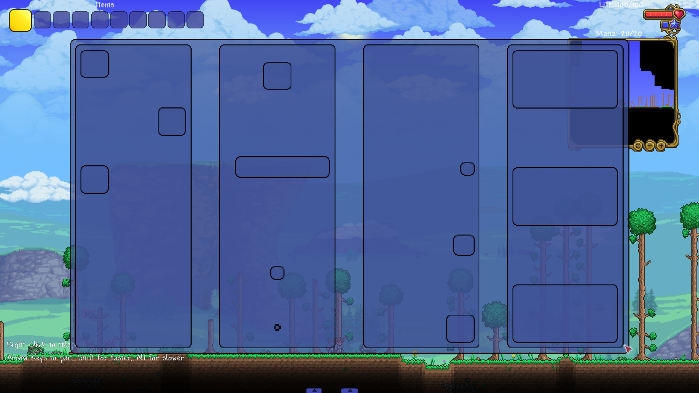

<h1 align="center">Клас <code>UIExStackPanel</code></h1>

---

* Ця бібліотека передбачає, що ви вже вивчили [базовий посібник tModLoader щодо користувацького інтерфейсу](https://github.com/tModLoader/tModLoader/wiki/Basic-UI-Element)<br>
* Ця бібліотека передбачає, що ви вже вивчили [розширений посібник з налаштування користувацького інтерфейсу](https://github.com/tModLoader/tModLoader/wiki/Advanced-guide-to-custom-UI)<br>
* Ця стаття передбачає, що ви вивчили статтю: [«структура стилів»](../Розділ-1/1.3-StyleStructure.md)
* Ця стаття передбачає, що ви вивчили статтю: [«клас UIExLayout. Основи компонування»](2.1-UIExLayout.md)

---

<br>

---

`UIExStackPanel` - це контейнер компонування, який розташовує дочірні елементи в одну лінію (стос) по вертикалі або по горизонталі.<br>

---

Базовий стиль компонування елементів `StyleLayoutContainer`:

```csharp
public partial class StyleLayoutContainer : Base.StyleLayoutContainerBase
{
    public Enums.UIExOrientation Orientation = Enums.UIExOrientation.Vertical;
    public Enums.UIExAlignment JustifyContent = Enums.UIExAlignment.Auto;
    public Enums.UIExAlignment AlignItems = Enums.UIExAlignment.Auto;
}
```

* `Orientation`: визначає головну вісь контейнера, за якою будуть вирівнюватися елементи.
* `JustifyContent`: вирівнювання елементів за головною віссю.
* `AlignItems`: вирівнювання елементів за поперечною віссю.<br>

Типи вирівнювання:

```csharp
public enum UIExAlignment : byte
{
    Auto,
    Start,
    Center,
    End,
    Stretch
}
```

* `Auto`: аналогічно `Start`. Використовується у вкладених у контейнер елементів.
* `Start`: вирівнювання елементів за початком осі (верх/ліво).
* `Center`: вирівнювання елементів за центром осі.
* `End`: вирівнювання елементів за кінцем осі (низ/право).
* `Stretch`: розтягування елемента по всій осі (за вирахуванням `Margin`).<br>

---

Базові стилі дочірніх елементів `StyleLayoutChild`:

```csharp
public partial class StyleLayoutChild : Base.StyleLayoutChildBase
{
    public Enums.UIExAlignment JustifySelf = Enums.UIExAlignment.Auto;
    public Enums.UIExAlignment AlignSelf = Enums.UIExAlignment.Auto;
    public UIExThickness Margin = new();
    public StyleDimension Width = default(StyleDimension);
    public StyleDimension Height = default(StyleDimension);
}
```

* Поле `JustifySelf` у дочірніх елементів ігнорує будь-які значення, крім значення `Stretch`.
* Поле `AlignSelf` перевизначає значення `AlignItems` для конкретного вкладеного елемента.
* Поле `Margin` працює повноцінно.
* Поля `Width` і `Height` детально розглядалися в першій статті цього розділу.

---

Для класу `UIExStackPanel` використовується клас стилів: `StyleLayoutContainerStackPanel`, який зберігає всі стилі компонування для цього класу.

```csharp
public class StyleLayoutContainerStackPanel : Base.StyleLayoutContainerBase
{
    public StyleDimension Spacing = StyleDimension.Empty;
    public bool Reverse = false;

    public void Set(StyleDimension spacing, bool reverse) { /* ... */ }
    public void Copy(StyleLayoutContainerStackPanel style) { /* ... */ }
    public StyleLayoutContainerStackPanel GetCopy() { /* ... */ }
}
```

* `Spacing`:

  * Відповідає за простір між дочірніми елементами `UIExStackPanel`.
  * Працює навіть якщо `JustifyContent` та/або `AlignItems` == `UIExAlignment.Stretch`
* `Reverse`:

  * Прапорець, що відповідає за розташування елементів у реверсивному порядку.
  * При `true` — усі елементи будуть розташовані у зворотному порядку, зберігаючи всі інші характеристики стилю.

    <br>

---

**НЕ РЕАЛІЗУЄ** власний клас стилю для дочірніх елементів.<br>

---

* Базові стилі компонування контейнера містяться в полі `StyleLayout`.
* Для отримання стилів компонування `UIExStackPanel` використовуйте метод `StackPanel()` у полі `StyleLayout`.
* Для отримання базових стилів для вкладених у контейнер елементів використовуйте метод розширення `UIElement`: `StyleLayoutChild()`.<br>

```csharp
UIExStackPanel stackPanel = new();

StyleLayoutContainer style = stackPanel.StyleLayout;
StyleLayoutContainerStackPanel styleStackPanel = stackPanel.StyleLayout.StackPanel(); // або style.StackPanel();

UIElement element = new();
StyleLayoutChild styleChild = element.StyleLayoutChild();

style.JustifyContent = UIExAlignment.Center;
styleStackPanel.Reverse = true;

styleChild.JustifySelf = UIExAlignment.Stretch;
```

---

<h2 align="center">Приклад використання <i>UIExStackPanel</i></h2>

<details>
<summary>Приклад створення користувацького інтерфейсу (без коментарів, розбір нижче)</summary>

```csharp
using Terraria.GameContent.UI.Elements;
using Terraria.UI;
using Microsoft.Xna.Framework;
using UIeXtension;
using UIeXtension.Enums;
using UIeXtension.MethodsExtensions;
using UIeXtension.Styles;

namespace UIeXtensionExample;

public class ExampleMenuUI : UIExModSystem<ExamplePanelUI> { }

public class ExamplePanelUI : UIState
{
    // метод OnActivate() у цьому випадку використовується лише
    // для функції «гарячого перезавантаження коду» в середовищі розробки.
    // для реального інтерфейсу правильніше було б використовувати
    // метод OnInitialize()
    public override void OnActivate()
    {
        RemoveAllChildren();

        UIPanel panel = new UIPanel();
        SetPrecentSizeCenter(0.8f, 0.8f, panel);

        UIExStackPanel HStackPanel = new();
        HStackPanel.Stretch();

        HStackPanel.StyleLayout.Set(
            orientation:        UIExOrientation.Horizontal,
            justifyContent:     UIExAlignment.Stretch,
            alignItems:         UIExAlignment.Stretch);
        HStackPanel.StyleLayout.StackPanel().Set(
            spacing:            new StyleDimension(0f, 0.05f),
            reverse:            false);

        panel.Append(HStackPanel);

        //////

        UIPanel HPanel1 = new(), HPanel2 = new(), HPanel3 = new(), HPanel4 = new();
        HStackPanel.Append(HPanel1);
        HStackPanel.Append(HPanel2);
        HStackPanel.Append(HPanel3);
        HStackPanel.Append(HPanel4);

        /////

        UIExStackPanel VStackPanel1 = new(), VStackPanel2 = new(), VStackPanel3 = new(), VStackPanel4 = new();
        SetPrecentSizeCenter(1f, 1f, VStackPanel1, VStackPanel2, VStackPanel3, VStackPanel4);
        HPanel1.Append(VStackPanel1);
        HPanel2.Append(VStackPanel2);
        HPanel3.Append(VStackPanel3);
        HPanel4.Append(VStackPanel4);

        VStackPanel1.StyleLayout.Set(
            orientation:        UIExOrientation.Vertical,
            justifyContent:     UIExAlignment.Start,
            alignItems:         UIExAlignment.Start);
        VStackPanel1.StyleLayout.StackPanel().Set(
            spacing:            new StyleDimension(0f, 0.1f),
            reverse:            false);

        UIElement[] cubs2_1 = AddCubs(VStackPanel1, pixelSize: 64f, count: 3);


        StyleLayoutChild stylePanel2_1 = cubs2_1[1].StyleLayoutChild();

        stylePanel2_1.AlignSelf = UIExAlignment.End;

        ////

        VStackPanel2.StyleLayout.Set(
            orientation:        UIExOrientation.Vertical,
            justifyContent:     UIExAlignment.Center,
            alignItems:         UIExAlignment.Center);
        VStackPanel2.StyleLayout.StackPanel().Set(
            spacing:            new StyleDimension(0f, 0.15f),
            reverse:            true);

        UIElement[] cubs2_2 = AddCubs(VStackPanel2, 16f, 32f, 48f, 64f);


        StyleLayoutChild stylePanel2_2 = cubs2_2[2].StyleLayoutChild();

        stylePanel2_2.Set(
                                // нічого не робить, UIExStackPanel не враховує JustifySelf,
                                // крім значення Stretch
            justifySelf:        UIExAlignment.End, 
            alignSelf:          UIExAlignment.Stretch,
            width:              stylePanel2_2.Width,
            height:             stylePanel2_2.Height,
            margin:             new UIExThickness(
                                    pixels: false,
                                    left:   0.25f,
                                    top:    0.075f,
                                    right:  0f,
                                    bottom: 0.015f));

        ////

        VStackPanel3.StyleLayout.Set(
            orientation:        UIExOrientation.Vertical,
            justifyContent:     UIExAlignment.End,
            alignItems:         UIExAlignment.End);
        VStackPanel3.StyleLayout.StackPanel().Set(
            spacing:            new StyleDimension(0f, 0.20f),
            reverse:            false);

        AddCubs(VStackPanel3, 32f, 48f, 64f);

        ////

        VStackPanel4.StyleLayout.Set(
            orientation:        UIExOrientation.Vertical,
            justifyContent:     UIExAlignment.Stretch,
            alignItems:         UIExAlignment.Stretch);
        VStackPanel4.StyleLayout.StackPanel().Set(
            spacing:            new StyleDimension(0f, 0.20f),
            reverse:            false);

        AddCubs(VStackPanel4, pixelSize: 60f);
        AddCubs(VStackPanel4, pixelSize: 50f);
        AddCubs(VStackPanel4, pixelSize: 70f);

        ////

        HStackPanel.SetLayoutLinesInfoForBranch(
            state: true, 
            thickness: 3f, 
            color: Color.DarkOrange);

        ///

        Append(panel);
    }

    public void SetPrecentSizeCenter(float width, float height, params UIElement[] elements)
    {
        foreach (var element in elements)
        {
            element.Width.Set(0f, width);
            element.Height.Set(0f, height);
            element.HAlign = 0.5f;
            element.VAlign = 0.5f;
        }
    }

    public UIElement[] AddCubs(UIElement element, params float[] pixelSizes)
    {
        int count = pixelSizes.Length;
        var panels = new UIElement[count];
        for (int i = 0; i < count; i++)
            panels[i] = AddCubs(element, pixelSizes[i], count: 1)[0];
        return panels;
    }

    public UIElement[] AddCubs(UIElement element, float pixelSize, int count = 1)
    {
        var panels = new UIElement[count];
        for (int i = 0; i < count; i++)
        {
            panels[i] = new UIPanel();
            StyleLayoutChild style = panels[i].StyleLayoutChild();
            style.Width.Set(pixelSize, 0f);
            style.Height.Set(pixelSize, 0f);
            element.Append(panels[i]);
        }
        return panels;
    }
}
```

</details>

<p align="center">
  
  <br>
  <em>Рис. 1.1. Візуальне відображення роботи коду</em>
</p>

---

На зображенні видно наступне:

1. Головна панель (розміром у 80% екрана).
2. 4 вертикальні секції (розміром зі 100% висоти та рівномірно розтягнуті за шириною, за винятком відступів).
3. У кожній із чотирьох секцій: різна кількість кубів із різним розміром ребер.

---

Трохи про візуальні стилі. Це тема наступного розділу, але тут є 1 важливий момент для компонувальників, тому ця примітка буде в кожній статті.<br>
Як видно, у цьому коді система така: головна панель -> контейнер -> панель секції -> контейнер -> панель куба.<br>
Для кожної панелі створюється власний контейнер (крім кубів).<br>
Це зайве, якщо результат саме той, який ми хочемо бачити на зображенні.<br>
`UIExElement` (від якого успадковується `UIExLayout`) має властивість стилю: `StyleDisplay.tModLoaderStyle (bool)`.<br>
Якщо це значення істинне, то візуальний елемент прийматиме відповідний стиль **tModLoader**.<br>
Для `UIExElement` значення `true` призведе до того, що стиль буде аналогічним `UIPanel`.<br>
Отже, наш код міг би бути скорочений.<br><br>

Наприклад, ось цю частину:

```csharp
UIPanel panel = new UIPanel();
SetPrecentSizeCenter(0.8f, 0.8f, panel);

UIExStackPanel HStackPanel = new();
HStackPanel.Stretch();

HStackPanel.StyleLayout.Set(
    orientation:        UIExOrientation.Horizontal,
    justifyContent:     UIExAlignment.Stretch,
    alignItems:         UIExAlignment.Stretch);
HStackPanel.StyleLayout.StackPanel().Set(
    spacing:            new StyleDimension(0f, 0.05f),
    reverse:            false);

panel.Append(HStackPanel);
/*
...
*/
Append(panel);
```

Можна замінити на наступну:

```csharp
UIExStackPanel HStackPanel = new();
HStackPanel.StyleDisplay.tModLoaderStyle = true;
SetPrecentSizeCenter(0.8f, 0.8f, HStackPanel);

HStackPanel.StyleLayout.Set(
    orientation:        UIExOrientation.Horizontal,
    justifyContent:     UIExAlignment.Stretch,
    alignItems:         UIExAlignment.Stretch);
HStackPanel.StyleLayout.StackPanel().Set(
    spacing:            new StyleDimension(0f, 0.05f),
    reverse:            false);
/*
...
*/
Append(HStackPanel);
```

Як видно у другому коді, елемент `UIPanel panel` зник. Сам контейнер компонування `HStackPanel` став одночасно головним контейнером.

---

Перше, що ви бачите в коді:

```csharp
UIPanel panel = new UIPanel();
SetPrecentSizeCenter(0.8f, 0.8f, panel);
```

Це головна панель, яка буде додана до `UIState`. На ній будуть розташовуватися `UIExStackPanel`.<br><br>
`SetPrecentSizeCenter` - це допоміжний метод, якого немає в самій бібліотеці, і який визначений нижче в цьому ж класі.
Він отримує N `UIElement`, встановлює їм передану висоту та ширину і центрує. У цьому випадку наша `panel` має розмір: 80%х80% екрана.<br><br>

---

Далі в коді йде перший `UIExStackPanel`:

```csharp
UIExStackPanel HStackPanel = new();
HStackPanel.Stretch();

HStackPanel.StyleLayout.Set(
    orientation:        UIExOrientation.Horizontal,
    justifyContent:     UIExAlignment.Stretch,
    alignItems:         UIExAlignment.Stretch);
HStackPanel.StyleLayout.StackPanel().Set(
    spacing:            new StyleDimension(0f, 0.05f),
    reverse:            false);

panel.Append(HStackPanel);

//////

UIPanel HPanel1 = new(), HPanel2 = new(), HPanel3 = new(), HPanel4 = new();
HStackPanel.Append(HPanel1);
HStackPanel.Append(HPanel2);
HStackPanel.Append(HPanel3);
HStackPanel.Append(HPanel4);
```

* `HStackPanel.Stretch();` - встановлює розміри `HStackPanel`: 100% від батьківського елемента.
* Нижче ми додаємо `HStackPanel` до головної панелі `panel.Append(HStackPanel);`, що означає, що `HStackPanel` буде компонувати елементи по всій головній панелі, тобто по всьому створеному інтерфейсу.
* `Set` - це метод, який є в будь-якого класу стилю в бібліотеці. Кожен Set стилю приймає значення для **ВСІХ** наявних полів класу стилю.
* Його стилі `StyleLayoutContainer StyleLayout`:

  * `Orientation`: Головна вісь контейнера. `Vertical` - горизонтальна.
  * `JustifyContent` (вирівнювання елементів за головною віссю) (головна вісь - горизонтальна): `stretch` - елементи займають увесь доступний простір за шириною.
  * `AlignItems` (вирівнювання елементів за поперечною віссю) (поперечна вісь - вертикальна): `stretch` - елементи займають увесь доступний простір за висотою.
* Його стилі `StyleLayoutContainerStackPanel StyleLayoutStackPanel`:

  * `Spacing`: 5% від розміру головної осі контейнера (у цьому випадку: 5% від ширини `HStackPanel`).
  * `Reverse`: false - елементи розташовуються в тому порядку, у якому вони будуть додані до `HStackPanel`.

Нижче в `HStackPanel` додано 4 секції `HPanel_N`:

* `HStackPanel` спочатку виділить місце під `Spacing (5% * HStackPanel.Width * (HStackPanel.GetWithLayoutElementsCount() - 1))`
* Потім порахує вільний простір і поділить його між цими секціями.
* Результат цього ви можете переглянути самостійно. На зображенні це 4 найвищі вертикальні секції на всю висоту контейнера.

---

```csharp
UIExStackPanel VStackPanel1 = new(), VStackPanel2 = new(), VStackPanel3 = new(), VStackPanel4 = new();
SetPrecentSizeCenter(1f, 1f, VStackPanel1, VStackPanel2, VStackPanel3, VStackPanel4);
HPanel1.Append(VStackPanel1);
HPanel2.Append(VStackPanel2);
HPanel3.Append(VStackPanel3);
HPanel4.Append(VStackPanel4);
```

Для кожної з раніше створених секцій (`HPanel_N`) створюється власний `UIExStackPanel (VStackPanel_N)`.<br>
`VStackPanel_N` - компонуватимуть куби всередині кожної із секцій.
Далі кожен із `VStackPanel_N` отримує розміри 100% свого батьківського елемента та додається до відповідної панелі `HPanel_N`<br>

---

Хочу на цьому місці підбити проміжний підсумок.
На цей момент у нас система така:

* `UIPanel panel` - головна панель. Має 80% розміру екрана. Усередині неї розташований:<br>

  * `UIExStackPanel HStackPanel` - компонувальник усередині головної панелі. Має 100% розміру головної панелі. Усередині нього розташовані:<br>

    * `UIPanel HPanel_1-4` - секції 1-4. Мають 100% висоти `HStackPanel` і 25% від вільного простору. Усередині них:<br>

      * `UIExStackPanel VStackPanel_1-4` - компонувальники всередині відповідної секції. Мають 100% розміру відповідної секції. Усередині них<br>

        * N-кількістю кубів із різним розміром ребер.

<br>

<table align="center"> 
    <tr> <th>Елемент</th> <th>Розмір / положення</th> <th>Призначення</th> </tr> 
    <tr> 
        <td><code>UIPanel panel</code></td> 
        <td>80% екрана</td> 
        <td>Головна панель</td> </tr> 
    <tr> 
        <td><code>UIExStackPanel HStackPanel</code></td> 
        <td>100% × 100% <code>panel</code></td> 
        <td>Горизонтальне розташування секцій</td> </tr> 
    <tr> 
        <td><code>UIPanel HPanel_1–4</code>
        </td> <td>100% висоти<br>25% вільної ширини</td> 
        <td>Чотири горизонтальні секції</td> </tr> 
    <tr> 
        <td><code>UIExStackPanel VStackPanel_1–4</code>
        </td> <td>100% × 100% <code>HPanel_1–4</code></td> 
        <td>Вертикальне розташування кубів<br>усередині відповідної секції</td> 
    </tr> 
</table>

---

Далі для кожного компонувальника всередині кожної секції `VStackPanel_1–4` задається стиль компонування та додаються всередину куби (`UIPanel`) за допомогою методів:

```csharp
public UIElement[] AddCubs(UIElement element, params float[] pixelSizes)
{
    int count = pixelSizes.Length;
    var panels = new UIElement[count];
    for (int i = 0; i < count; i++)
        panels[i] = AddCubs(element, pixelSizes[i], count: 1)[0];
    return panels;
}

public UIElement[] AddCubs(UIElement element, float pixelSize, int count = 1)
{
    var panels = new UIElement[count];
    for (int i = 0; i < count; i++)
    {
        panels[i] = new UIPanel();
        StyleLayoutChild style = panels[i].StyleLayoutChild();
        style.Width.Set(pixelSize, 0f);
        style.Height.Set(pixelSize, 0f);
        element.Append(panels[i]);
    }
    return panels;
}
```

Ці методи також створені спеціально для цього прикладу та не існують у самій бібліотеці.<br>

Зверніть увагу, що розмір усередині методу задається за допомогою стилю StyleLayoutChild.
Оскільки дочірнім елементам усередині компонувальника можна задавати розміри лише таким чином:

```csharp
panels[i] = new UIPanel();
StyleLayoutChild style = panels[i].StyleLayoutChild();
style.Width.Set(pixelSize, 0f);
style.Height.Set(pixelSize, 0f);
element.Append(panels[i]);
```

---

Немає сенсу розбирати весь код. Розберемо лише дві частини коду, де змінюються стилі вкладених у контейнер елементів<br><br>

Перша частина:

```csharp
VStackPanel1.StyleLayout.Set(
    orientation:        UIExOrientation.Vertical,
    justifyContent:     UIExAlignment.Start,
    alignItems:         UIExAlignment.Start);
VStackPanel1.StyleLayout.StackPanel().Set(
    spacing:            new StyleDimension(0f, 0.1f),
    reverse:            false);

UIElement[] cubs2_1 = AddCubs(VStackPanel1, pixelSize: 64f, count: 3);


StyleLayoutChild stylePanel2_1 = cubs2_1[1].StyleLayoutChild();

stylePanel2_1.AlignSelf = UIExAlignment.End;
```

У цьому коді задаються стилі для контейнера всередині першої секції.<br>
Потім задаються стилі для другого куба всередині першої секції.<br>

У результаті в нас виходить наступна система:

<table align="center"> 
    <tr> <th>Стиль</th> <th>Значення</th> </tr> 
    <tr> 
        <td><code>orientation: UIExOrientation.Vertical</code></td> 
        <td>Головна вісь компонування першої секції - вертикальна.</td> 
    </tr>
    <tr> 
        <td><code>justifyContent: UIExAlignment.Start</code></td> 
        <td>Усі куби вирівнюються за стартовою позицією за головною віссю (зверху)</td> 
    </tr>
    <tr> 
        <td><code>alignItems: UIExAlignment.Start</code></td> 
        <td>Усі куби (крім 1-го) вирівнюються за стартовою позицією за поперечною віссю (ліворуч)</td> 
    </tr>
    <tr> 
        <td><code>spacing: new StyleDimension(0f, 0.1f)</code></td> 
        <td>Відступ між елементами за головною віссю: 10% від розміру головної осі контейнера (10% від `Height` контейнера)</td> 
    </tr>
    <tr> 
        <td><code>reverse: false</code></td> 
        <td>Реверсії елементів немає. Дочірні елементи розташовуються в тому порядку, у якому додані.</td> 
    </tr> 
</table>

Для другого куба зареєстровано стиль і змінено поле `AlignSelf = UIExAlignment.End`.<br>
Це означає, що цей куб ігнорує значення `AlignItems` контейнера та вирівнюється за кінцем поперечної осі (праворуч у цьому випадку).<br><br><br>

Друга частина коду:

```csharp
VStackPanel2.StyleLayout.Set(
    orientation:        UIExOrientation.Vertical,
    justifyContent:     UIExAlignment.Center,
    alignItems:         UIExAlignment.Center);
VStackPanel2.StyleLayout.StackPanel().Set(
    spacing:            new StyleDimension(0f, 0.15f),
    reverse:            true);

UIElement[] cubs2_2 = AddCubs(VStackPanel2, 16f, 32f, 48f, 64f);


StyleLayoutChild stylePanel2_2 = cubs2_2[2].StyleLayoutChild();

stylePanel2_2.Set(
                        // нічого не робить, UIExStackPanel не враховує JustifySelf,
                        // крім значення Stretch
    justifySelf:        UIExAlignment.End, 
    alignSelf:          UIExAlignment.Stretch,
    width:              stylePanel2_2.Width,
    height:             stylePanel2_2.Height,
    margin:             new UIExThickness(
                            pixels: false,
                            left:   0.25f,
                            top:    0.075f,
                            right:  0f,
                            bottom: 0.015f));
```

<table align="center"> 
    <tr> <th>Стиль</th> <th>Значення</th> </tr> 
    <tr> 
        <td><code>orientation: UIExOrientation.Vertical</code></td> 
        <td>Головна вісь компонування першої секції - вертикальна.</td> 
    </tr>
    <tr> 
        <td><code>justifyContent: UIExAlignment.Center</code></td> 
        <td>Усі куби вирівнюються за стартовою позицією за головною віссю (зверху)</td> 
    </tr>
    <tr> 
        <td><code>alignItems: UIExAlignment.Center</code></td> 
        <td>Усі куби (крім 3-го) вирівнюються за стартовою позицією за поперечною віссю (ліворуч)</td> 
    </tr>
    <tr> 
        <td><code>spacing: new StyleDimension(0f, 0.15f)</code></td> 
        <td>Відступ між елементами за головною віссю: 15% від розміру головної осі контейнера (15% від `Height` контейнера)</td> 
    </tr>
    <tr> 
        <td><code>reverse: true</code></td> 
        <td>Реверсія елементів. Дочірні елементи розташовуються у зворотному порядку.</td> 
    </tr> 
</table><br>

Далі додаються 4 куби, і 3-му з них додається стиль:

<table align="center"> 
    <tr> <th>Стиль</th> <th>Значення</th> </tr> 
    <tr> 
        <td><code>JustifySelf: UIExAlignment.End</code></td> 
        <td>Нічого не робить. Контейнер <code>UIExStackPanel</code> не враховує це значення у дочірніх елементів</td> 
    </tr>
    <tr> 
        <td><code>AlignSelf: UIExAlignment.Stretch</code></td> 
        <td>3-й куб розтягується за шириною поперечної осі (за всією шириною 3-ї секції, у цьому випадку)</td> 
    </tr>
    <tr> 
        <td><code>margin:<br>
    new UIExThickness<br>(
        <br>pixels: false,
        <br>left: 0.1f,
        <br>top: 0.075f,
        <br>right: 0f,
        <br>bottom: 0.15f)</code>
        </td> 
        <td>Розмір `Margin` у відсотках</td> 
    </tr>
</table><br>

У цій статті не буде розбиратися `Margin`.<br>
Це поле надзвичайно детально розібране у статтях, присвячених `UIExLayout` і `UIExCanvas`.

---

Будь ласка, підтримайте цей проєкт: <a href="https://ko-fi.com/evilcriz">Ko-fi</a>, <a href="https://www.patreon.com/cw/EvilCriz">Patreon</a><br>

* Завдяки вашій допомозі я можу продовжувати займатися цим та іншими проєктами.
* Дякую!<br>

---

<table align="center" width="100%">
  <tr>
    <td align="left"><b>Попередня частина:</b></td>
    <td align="left">
      <a 
        href="2.2-UIExCanvas.md">
        Розділ II: Елементи компонування. Частина 2: «Клас UIExCanvas»
      </a>
    </td>
  </tr>
  <tr>
    <td align="left"><b>Наступна частина:</b></td>
    <td align="left">
      <a 
        href="2.4-UIExWrapPanel.md">
        Розділ II: Елементи компонування. Частина 4: «Клас UIExWrapPanel»
      </a>
    </td>
  </tr>
  <tr>
    <td align="left"><b>Зміст:</b></td>
    <td align="left"><a href="../README.md">Перейти до змісту</a></td>
  </tr>
</table>
