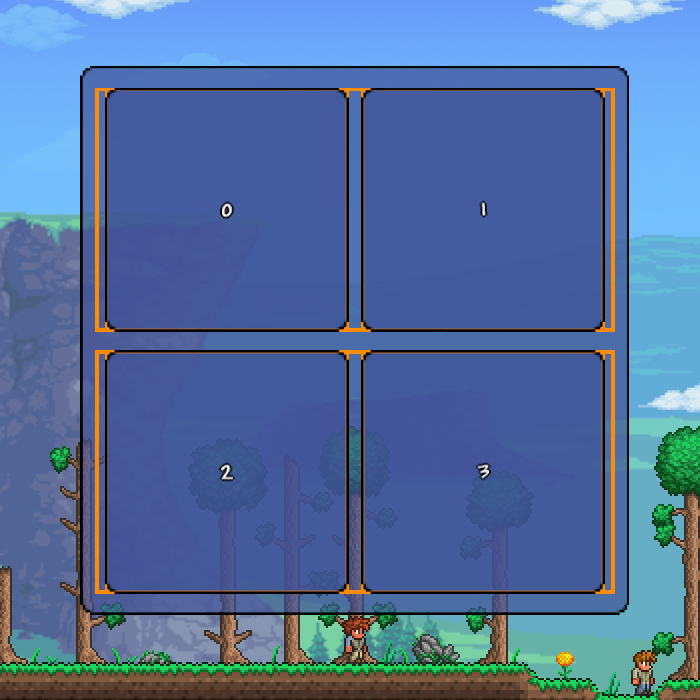
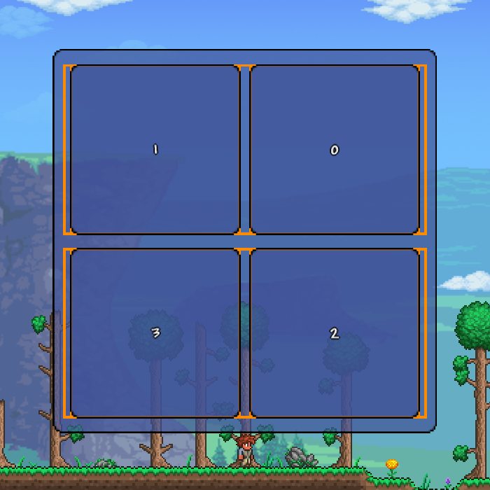
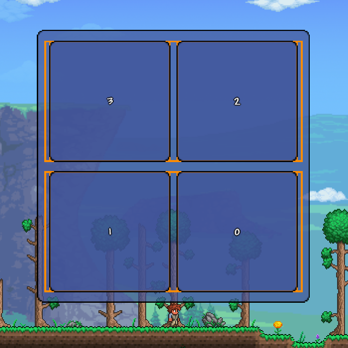
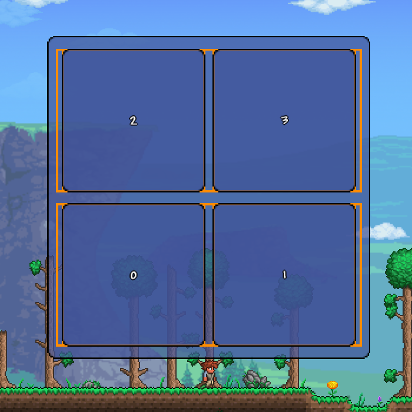
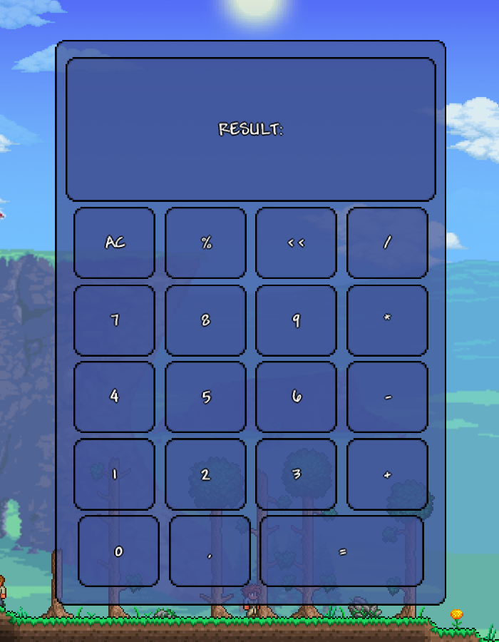

<h1 align="center">Клас <code>UIExWrapPanel</code></h1>

---

* Ця бібліотека передбачає, що ви вже вивчили [базовий посібник tModLoader щодо користувацького інтерфейсу](https://github.com/tModLoader/tModLoader/wiki/Basic-UI-Element)<br>
* Ця бібліотека передбачає, що ви вже вивчили [розширений посібник із налаштування користувацького інтерфейсу](https://github.com/tModLoader/tModLoader/wiki/Advanced-guide-to-custom-UI)<br>
* Ця стаття передбачає, що ви вивчили статтю: [«структура стилів»](../Розділ-1/1.3-StyleStructure.md)
* Ця стаття передбачає, що ви вивчили статтю: [«клас UIExLayout. Основи компонування»](2.1-UIExLayout.md)
* Ця стаття передбачає, що ви вивчили статтю: [«клас UIExStackPanel»](2.3-UIExStackPanel.md)

---

<br>

---

`UIExWrapPanel` — це контейнер компонування, який розташовує дочірні елементи в один рядок (або колонку) та автоматично переносить їх на новий рядок, якщо вони не поміщаються в поточну область.<br>

Цей контейнер фактично є ускладненою версією `UIExStackPanel`.<br>
Ця стаття повторюватиме попередню в дуже скороченому вигляді, припускаючи, що ви вже з нею ознайомлені.<br>

---

Перенесення елементів відбувається, коли наступний елемент не поміщається в рядок. Наприклад:<br>

* Контейнер шириною `300px` та горизонтальною орієнтацією.
* Простір між елементами: `50px`.
* У контейнер послідовно вкладені елементи шириною: `200px`, `50px`, `100px`.<br>

<!-- -->

У результаті ми отримаємо наступну послідовність:

1. Елемент шириною `200px` помістився в контейнер.
2. `50px` займає простір між елементами `0` та `1`.
3. Елемент шириною `50px` помістився в контейнер. (загалом зайнята ширина: `300px`).
4. У рядку закінчився вільний простір, наступний елемент буде розташований нижче.<br>

Зміщення останнього елемента (по поперечній осі) буде визначене розміром попереднього рядка + встановленим простором між рядками (про це нижче).<br>

1. Розмір лінії по головній осі займає весь доступний розмір контейнера по головній осі.
2. Розмір лінії по поперечній осі визначається розміром найбільшого елемента лінії по поперечній осі.
3. Розмір ліній визначається **ДО** того, як елемент буде розтягнутий (`Enums.UIExAlignment.Stretch`).<br>

<!-- -->

Нижче ви дізнаєтеся, що елементи можуть бути інвертовані.<br>
Інверсія елементів відбувається **ДО** розрахунку ліній та компонування елементів усередині них.

---

Після того як лінії сформовані, у кожній із них окремо елементи сортуються аналогічно `UIExStackPanel.`<br>
Але в цьому випадку використовується інший клас стилів.

---

Базовий стиль компонування елементів `StyleLayoutContainer`:

```csharp
public partial class StyleLayoutContainer : Base.StyleLayoutContainerBase
{
    public Enums.UIExOrientation Orientation = Enums.UIExOrientation.Vertical;
    public Enums.UIExAlignment JustifyContent = Enums.UIExAlignment.Auto;
    public Enums.UIExAlignment AlignItems = Enums.UIExAlignment.Auto;
}
```

* `Orientation`: визначає головну вісь контейнера, за якою будуть вирівнюватися елементи (всередині ліній).
* `JustifyContent`: вирівнювання елементів за головною віссю (всередині вже сформованих ліній).
* `AlignItems`: вирівнювання елементів за поперечною віссю (всередині вже сформованих ліній).

---

Типи вирівнювання:

```csharp
public enum UIExAlignment : byte
{
    Auto,
    Start,
    Center,
    End,
    Stretch
}
```

* `Auto`: аналогічно `Start`. Використовується у вкладених у контейнер елементах.
* `Start`: вирівнювання елементів за початком осі (верх/ліворуч).
* `Center`: вирівнювання елементів за центром осі.
* `End`: вирівнювання елементів за кінцем осі (низ/праворуч).
* `Stretch`: розтягування елемента по всій осі (за винятком Margin).

---

Базові стилі дочірніх елементів `StyleLayoutChild`:

```csharp
public partial class StyleLayoutChild : Base.StyleLayoutChildBase
{
    public Enums.UIExAlignment JustifySelf = Enums.UIExAlignment.Auto;
    public Enums.UIExAlignment AlignSelf = Enums.UIExAlignment.Auto;
    public UIExThickness Margin = new();
    public StyleDimension Width = default(StyleDimension);
    public StyleDimension Height = default(StyleDimension);
}
```

* Поле `JustifySelf` перевизначає значення `JustifyContent` контейнера для конкретного вкладеного елемента. У дочірніх елементів ігнорує будь-які значення, крім значення `Stretch`.
* Поле `AlignSelf` перевизначає значення `AlignItems` контейнера для конкретного вкладеного елемента.
* Поле `Margin` працює повноцінно.
* Поля `Width` та `Height` детально розглядалися в першій статті цього розділу.

---

Для класу `UIExWrapPanel` використовується клас стилів: `StyleLayoutContainerWrapPanel`, який зберігає всі стилі компонування для цього класу.

```csharp
public class StyleLayoutContainerWrapPanel : Base.StyleLayoutContainerBase
{
    public StyleDimension SpacingWithinLine = StyleDimension.Empty;
    public StyleDimension SpacingBetweenLines = StyleDimension.Empty;
	
    public Enums.UIExAlignment AlignLines = Enums.UIExAlignment.Auto;
	
    public bool ReverseWithinLine = false;
    public bool ReverseAll = false;
}
```

* `SpacingWithinLine`: визначає відступ між елементами всередині ліній (працює аналогічно `Spacing` контейнера `UIExStackPanel`).
* `SpacingBetweenLines`: визначає відступ між лініями.
* `AlignLines`: визначає вирівнювання всіх ліній за поперечною віссю.
* `ReverseWithinLine`: якщо це значення `true` — елементи всередині кожної лінії будуть розташовуватися в реверсивному порядку.
* `ReverseAll`: якщо це значення `true` — усі елементи будуть розташовуватися в реверсивному порядку (і будуть реверсовані ще до початку компонування).<br>

<!-- -->

* `ReverseWithinLine` та `ReverseAll` можуть реверсувати одночасно. У цьому випадку до компонування спрацює `ReverseAll`, а всередині ліній елементи будуть реверсовані окремо.

---

**НЕ РЕАЛІЗУЄ** власний клас стилю для дочірніх елементів.

---

Базові стилі компонування контейнера містяться в полі `StyleLayout`.
Для отримання стилів компонування `UIExWrapPanel` використовуйте метод `WrapPanel()` у полі StyleLayout.
Для отримання базових стилів для вкладених у контейнер елементів використовуйте метод розширення`UIElement`: `StyleLayoutChild()`.

```csharp
UIExWrapPanel wrapPanel = new();

StyleLayoutContainer style = wrapPanel.StyleLayout;
StyleLayoutContainerWrapPanel styleWrapPanel = stackPanel.StyleLayout.WrapPanel(); // або style.WrapPanel();

UIElement element = new();
StyleLayoutChild styleChild = element.StyleLayoutChild();

style.JustifyContent = UIExAlignment.Center;
styleWrapPanel.ReverseAll = true;

styleChild.JustifySelf = UIExAlignment.Stretch;
```

---

<details>

<summary>Приклад роботи <code>ReverseWithinLine</code> та <code>ReverseAll</code>:</summary>

```csharp
using Microsoft.Xna.Framework;
using Terraria.GameContent.UI.Elements;
using Terraria.ModLoader.UI;
using Terraria.UI;
using UIeXtension;
using UIeXtension.Enums;
using UIeXtension.MethodsExtensions;
using UIeXtension.Styles;

namespace UIeXtensionExample;

public class ExampleMenuUI : UIExModSystem<ExamplePanelUI> { }

public class ExamplePanelUI : UIState
{
    // метод OnActivate() у цьому випадку використовується лише
    // для функції «гарячого перезавантаження коду» в середовищі розробки.
    // для реального інтерфейсу правильніше було б використовувати
    // метод OnInitialize()
    public override void OnActivate()
    {
        RemoveAllChildren();

        UIPanel panel = new UIPanel();
        SetPixelsSizeCenter(width: 450f, height: 450f, panel);

        UIExWrapPanel wrapPanel = new();
        wrapPanel.Stretch();

        wrapPanel.SetLayoutLinesInfoForBranch(
            state: true,
            thickness: 3f,
            color: Color.DarkOrange);

        ////////////////////////////

        StyleLayoutContainer styleLayout = wrapPanel.StyleLayout;
        StyleLayoutContainerWrapPanel styleLayoutWrap = styleLayout.WrapPanel();

        styleLayout.Set(
            orientation: UIExOrientation.Horizontal,
            justifyContent: UIExAlignment.Center,
            alignItems: UIExAlignment.Center);

        styleLayoutWrap.Set(
            spacingWithinLine: StyleDimension.FromPixels(10f),
            spacingBetweenLines: StyleDimension.FromPixels(15f),
            alignLines: UIExAlignment.Center,
			// на зображеннях 4 варіанти комбінації цих двох значень
            reverseWithinLine: true,
            reverseAll: true); //

        ///////////////////////////

        AddPixelButton(wrapPanel, prefix: 0, width: 200f, height: 200f);
        AddPixelButton(wrapPanel, prefix: 1, width: 200f, height: 200f);
        AddPixelButton(wrapPanel, prefix: 2, width: 200f, height: 200f);
        AddPixelButton(wrapPanel, prefix: 3, width: 200f, height: 200f);

        ///////////////////////////

        panel.Append(wrapPanel);
        Append(panel);
    }

    public void SetPixelsSizeCenter(float width, float height, params UIElement[] elements)
    {
        foreach (var element in elements)
        {
            element.Width.Set(width, 0f);
            element.Height.Set(height, 0f);
            element.HAlign = 0.5f;
            element.VAlign = 0.5f;
        }
    }

    public UIButton<string> AddPixelButton(UIExLayout layout, int prefix, float width, float height)
        => AddPixelButton(layout, prefix.ToString(), width, height);
    public UIButton<string> AddPixelButton(UIExLayout layout, string prefix, float width, float height)
    {
        UIButton<string> button = new($"{prefix}");
        StyleLayoutChild style = button.StyleLayoutChild();
        style.Width.Pixels = width;
        style.Height.Pixels = height;
        layout.Append(button);
        return button;
    }
}
```

</details>

<table align="center">
  <tr>
    <td>
        <p align="center">
          
          <br>
          <em>Рис. 1.1. <code>ReverseWithinLine == false</code> <code>ReverseAll == false</code></em>
        </p>
    </td>
    <td>
        <p align="center">
          
          <br>
          <em>Рис. 1.2. <code>ReverseWithinLine == true</code> <code>ReverseAll == false</code></em>
        </p>
    </td>
  </tr>
  <tr>
    <td>
        <p align="center">
          
          <br>
          <em>Рис. 1.3. <code>ReverseWithinLine == false</code> <code>ReverseAll == true</code></em>
        </p>
    </td>
    <td>
        <p align="center">
          
          <br>
          <em>Рис. 1.4. <code>ReverseWithinLine == true</code> <code>ReverseAll == true</code></em>
        </p>
    </td>
  </tr>
</table>

---

<details>
<summary>Приклад створення макета калькулятора за допомогою <code>UIExWrapPanel</code> (без коментарів, розбір нижче)</summary>

```csharp
using Terraria.GameContent.UI.Elements;
using Terraria.ModLoader.UI;
using Terraria.UI;
using UIeXtenstion;
using UIeXtenstion.Enums;
using UIeXtenstion.Styles;

namespace UIeXtenstionExample;

public class ExampleMenuUI : UIExModSystem<ExamplePanelUI> { }

public class ExamplePanelUI : UIState
{
    // метод OnActivate() у цьому випадку використовується лише
    // для функції «гарячого перезавантаження коду» в середовищі розробки.
    // для реального інтерфейсу правильніше було б використовувати
    // метод OnInitialize()
    public override void OnActivate()
    {
        RemoveAllChildren();

        UIPanel panel = new UIPanel();
        SetPixelsSizeCenter(width: 450f, height: 650f, panel);

        UIExWrapPanel wrapPanel = new();
        wrapPanel.Stretch();

        ////////////////////////////

        StyleLayoutContainer styleLayout = wrapPanel.StyleLayout;
        StyleLayoutContainerWrapPanel styleLayoutWrap = styleLayout.WrapPanel();

        styleLayout.Set(
            orientation:    UIExOrientation.Horizontal,
            justifyContent: UIExAlignment.Center,
            alignItems:     UIExAlignment.Center);

        styleLayoutWrap.Set(
            spacingWithinLine:      StyleDimension.FromPixels(10f),
            spacingBetweenLines:    StyleDimension.FromPixels(5f),
            alignLines:             UIExAlignment.Center,
            reverseWithinLine:      false,
            reverseAll:             false);

        ///////////////////////////

        AppendButton(wrapPanel, prefix: "RESULT:");

        AppendButton(wrapPanel, prefix: "AC");
        AppendButton(wrapPanel, prefix: "%");
        AppendButton(wrapPanel, prefix: "<<");
        AppendButton(wrapPanel, prefix: "/");

        AppendButton(wrapPanel, prefix: 7);
        AppendButton(wrapPanel, prefix: 8);
        AppendButton(wrapPanel, prefix: 9);
        AppendButton(wrapPanel, prefix: "*");

        AppendButton(wrapPanel, prefix: 4);
        AppendButton(wrapPanel, prefix: 5);
        AppendButton(wrapPanel, prefix: 6);
        AppendButton(wrapPanel, prefix: "-");

        AppendButton(wrapPanel, prefix: 1);
        AppendButton(wrapPanel, prefix: 2);
        AppendButton(wrapPanel, prefix: 3);
        AppendButton(wrapPanel, prefix: "+");

        AppendButton(wrapPanel, prefix: 0);
        AppendButton(wrapPanel, prefix: ",");
        AppendButton(wrapPanel, prefix: "=");

        int count = 0;
        foreach (var child in wrapPanel.Children)
            count++;

        UIButton<string>[] buttons = new UIButton<string>[count];
        count = 0;
        foreach (var child in wrapPanel.Children)
            buttons[count++] = (UIButton<string>)child;

        for (int i = 0; i < count; i++)
        {
            StyleLayoutChild style = buttons[i].StyleLayoutChild();
            if (i == 0)
            {
                style.Width.Precent = 1f;
                style.Height.Precent = 2f / 7.5f;
            }
            else
            {
                style.Width.Precent = 1 / 4.5f;
                style.Height.Precent = 1 / 7.5f;
            }

            if (i == count - 1)
                style.Width.Precent *= 2f;
        }

        ///////////////////////////

        panel.Append(wrapPanel);
        Append(panel);
    }

    public void SetPixelsSizeCenter(float width, float height, params UIElement[] elements)
    {
        foreach (var element in elements)
        {
            element.Width.Set(width, 0f);
            element.Height.Set(height, 0f);
            element.HAlign = 0.5f;
            element.VAlign = 0.5f;
        }
    }

    public UIButton<string> AppendButton(UIExLayout layout, int prefix)
        => AppendButton(layout, prefix.ToString());
    public UIButton<string> AppendButton(UIExLayout layout, string prefix)
    {
        UIButton<string> button = new(prefix);
        layout.Append(button);
        return button;
    }
}
```

</details>

<p align="center">
  
  <br>
  <em>Рис. 1.5. Макет калькулятора</em>
</p>

---

У цій частині **не** будуть детально розбиратися створення елемента контейнера, отримання та встановлення стилів.<br>
Усе відбувається аналогічно `UIExStackPanel`.

```csharp
styleLayout.Set(
    orientation:    UIExOrientation.Horizontal,
    justifyContent: UIExAlignment.Center,
    alignItems:     UIExAlignment.Center);

styleLayoutWrap.Set(
    spacingWithinLine:      StyleDimension.FromPixels(10f),
    spacingBetweenLines:    StyleDimension.FromPixels(5f),
    alignLines:             UIExAlignment.Center,
    reverseWithinLine:      false,
    reverseAll:             false);
```

Стилі компонування будуть:

* Вертикальне розташування елементів.
* Центрування елементів за всіма осями всередині ліній.
* Відступ між елементами всередині ліній: `10px`.
* Відступ між лініями: `15px`.
* Лінії будуть центровані.
* Усі елементи будуть розташовані в тому порядку, у якому вони додані в контейнер.<br>

---

```csharp
AppendButton(wrapPanel, prefix: "RESULT:");

AppendButton(wrapPanel, prefix: "AC");
AppendButton(wrapPanel, prefix: "%");
AppendButton(wrapPanel, prefix: "<<");
AppendButton(wrapPanel, prefix: "/");

AppendButton(wrapPanel, prefix: 7);
AppendButton(wrapPanel, prefix: 8);
AppendButton(wrapPanel, prefix: 9);
AppendButton(wrapPanel, prefix: "*");

AppendButton(wrapPanel, prefix: 4);
AppendButton(wrapPanel, prefix: 5);
AppendButton(wrapPanel, prefix: 6);
AppendButton(wrapPanel, prefix: "-");

AppendButton(wrapPanel, prefix: 1);
AppendButton(wrapPanel, prefix: 2);
AppendButton(wrapPanel, prefix: 3);
AppendButton(wrapPanel, prefix: "+");

AppendButton(wrapPanel, prefix: 0);
AppendButton(wrapPanel, prefix: ",");
AppendButton(wrapPanel, prefix: "=");
```

Додавання елементів.

* Елементи починаються з верхнього-лівого (у цьому випадку — це просто лівий елемент із написом `RESULT`).
* Усі наступні елементи розташовуються лівіше попереднього та переносяться на наступний рядок за необхідності.
* Початкове зміщення елементів за `Top`, `Left` не має значення та ігнорується компонувальником.

---

```csharp
int count = 0;
foreach (var child in wrapPanel.Children)
    count++;

UIButton<string>[] buttons = new UIButton<string>[count];
count = 0;
foreach (var child in wrapPanel.Children)
    buttons[count++] = (UIButton<string>)child;
```

У цій частині коду підраховується кількість створених елементів та їх збереження в масив.

---

```csharp
for (int i = 0; i < count; i++)
{
    StyleLayoutChild style = buttons[i].StyleLayoutChild();
    if (i == 0)
    {
        style.Width.Precent = 1f;
        style.Height.Precent = 2f / 7.5f;
    }
    else
    {
        style.Width.Precent = 1 / 4.5f;
        style.Height.Precent = 1 / 7.5f;
    }

    if (i == count - 1)
        style.Width.Precent *= 2f;
}
```

Перш ніж почнемо розбирати цю частину коду, потрібно прояснити:

* Макет містить 6 ліній, у кожній з яких (крім 2-х) по 4 елементи.
* Елемент із написом `RESULT` (є першим доданим) буде займати розмір 2-х ліній та всю ширину лінії.
* Елемент із написом `=` (є останнім доданим) буде займати в `2` рази більше ширини, ніж інші елементи (крім 1-го).
* Усі інші елементи матимуть займати висоту 1/7 контейнера та ширину 1/4 лінії.<br>

Усі елементи, крім першого та останнього, отримують розмір у блоці `else`.<br>
Але хоча я раніше написав, що елементи мають займати 1/7 та 1/4 розміру контейнера, у цьому коді видно, що елементи займають 1/7.5 та 1/4.5.<br>
Уся справа в наступному:

* Якщо передбачається, що в рядку 4 елементи, то кожен має займати 1/4 його ширини.
* Але крім самих елементів, у нас також визначено відступ між елементами в `10px`.
* Тому я зменшив розмір самих елементів, щоб уникнути їх перенесення на новий рядок.<br>

Із висотою ситуація схожа:

* У нас є 6 рядків, і один із них у 2 рази більший за інші. Тобто елементи мають поділити вільну висоту на 1/7 (перший: на 2/7).
* Таке значення означало б, що рядки займуть 100% висоти внутрішньої області контейнера.
* Але в коді визначено міжрядковий інтервал у `15px`. Це означає, що сумарно наші кнопки займуть висоту: 100% + 15px * 5.
* Тому лінії також отримують 1/7.5 висоти, щоб не вийти за межі головної панелі.<br>

---

```csharp
if (i == 0)
{
    style.Width.Precent = 1f;
    style.Height.Precent = 2f / 7.5f;
}
```

Окреме задання першому елементу (`RESULT`) розміру:

* Ширина елемента розміром зі 100% ширини контейнера (це означає, що всі наступні елементи автоматично будуть перенесені на наступну лінію).
* Висота елемента розміром 2/7.5 рядка (і оскільки всі інші елементи мають значення 1/7.5, це означає, що цей рядок займатиме в 2 рази більшу висоту, ніж інші).<br>

---

```csharp
else
{
    style.Width.Precent = 1 / 4.5f;
    style.Height.Precent = 1 / 7.5f;
}

if (i == count - 1)
    style.Width.Precent *= 2f;
```

Після того як останній елемент отримає:

* Ширину розміром у 1/4.5 ширини контейнера.
* Висоту розміром 1/7.5 висоти контейнера.<br>

Його ширина додатково збільшується в 2 рази.<br>
Що робить його в 2 рази більшим за шириною, ніж усі інші елементи (крім 1-го).

---

Підсумовуючи:

1. Елемент з індексом 0 зайняв розмір: 2 ліній та всю ширину.
2. Місце в першому рядку закінчилося. Усі наступні елементи будуть перенесені на наступний.
3. Потім додаються наступні 4 елементи (індекс: 1-4) з розмірами 1/4.5 та 1/7.5.
4. Місце у другому рядку закінчилося. Усі наступні елементи будуть перенесені на наступний.
5. Потім додаються наступні 4 елементи (індекс: 5-8) з розмірами 1/4.5 та 1/7.5.
6. Місце у третьому рядку закінчилося. Усі наступні елементи будуть перенесені на наступний.
7. Потім додаються наступні 4 елементи (індекс: 9-12) з розмірами 1/4.5 та 1/7.5.
8. Місце у четвертому рядку закінчилося. Усі наступні елементи будуть перенесені на наступний.
9. Потім додаються наступні 4 елементи (індекс: 13-16) з розмірами 1/4.5 та 1/7.5.
10. Місце у п'ятому рядку закінчилося. Усі наступні елементи будуть перенесені на наступний.
11. Потім додаються наступні 2 елементи (індекс: 17-18) з розмірами 1/4.5 та 1/7.5. Місце в рядку **НЕ** закінчилося.
12. Потім додається наступний елемент (індекс: 19) з розміром 2/4.5 та 1/7.5.
13. Місце в рядку закінчилося. Але перенесення не відбувається, оскільки це був останній елемент.

---

Будь ласка, підтримайте цей проєкт: <a href="https://ko-fi.com/evilcriz">Ko-fi</a>, <a href="https://www.patreon.com/cw/EvilCriz">Patreon</a><br>

* Завдяки вашій допомозі я можу продовжувати займатися цим та іншими проєктами.
* Дякую!<br>

---

<table align="center" width="100%">
  <tr>
    <td align="left"><b>Попередня частина:</b></td>
    <td align="left">
      <a 
        href="2.3-UIExStackPanel.md">
        Розділ II: Елементи компонування. Частина 3: «Клас UIExStackPanel»
      </a>
    </td>
  </tr>
  <tr>
    <td align="left"><b>Наступна частина:</b></td>
    <td align="left">
      <a 
        href="2.5-UIExDockPanel.md">
        Розділ II: Елементи компонування. Частина 5: «Клас UIExDockPanel»
      </a>
    </td>
  </tr>
  <tr>
    <td align="left"><b>Зміст:</b></td>
    <td align="left"><a href="../README.md">Перейти до змісту</a></td>
  </tr>
</table>
