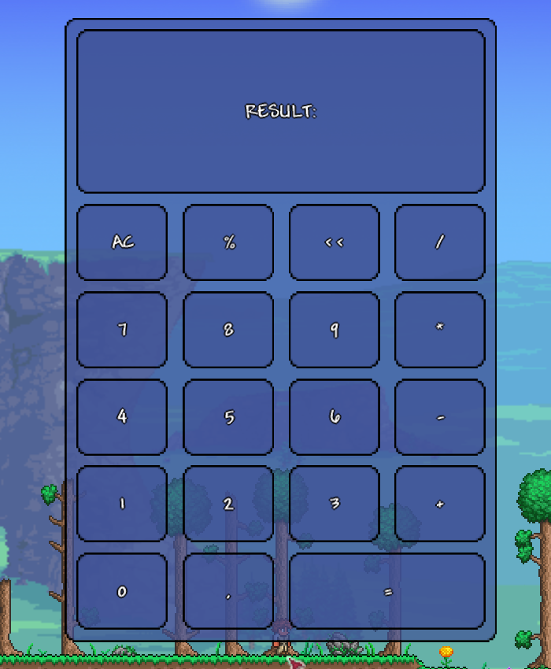

<h1 align="center">Клас <code>UIExUniformGrid</code></h1>

---

* Ця бібліотека передбачає, що ви вже вивчили [базовий посібник tModLoader з користувацького інтерфейсу](https://github.com/tModLoader/tModLoader/wiki/Basic-UI-Element)<br>
* Ця бібліотека передбачає, що ви вже вивчили [розширений посібник з налаштування користувацького інтерфейсу](https://github.com/tModLoader/tModLoader/wiki/Advanced-guide-to-custom-UI)<br>
* Ця стаття передбачає, що ви вивчили статтю: [«структура стилів»](../Розділ-1/1.3-StyleStructure.md)
* Ця стаття передбачає, що ви вивчили статтю: [«клас UIExLayout. Основи компоновки»](2.1-UIExLayout.md)
* Ця стаття передбачає, що ви вивчили статтю: [«клас UIExGrid»](2.6-UIExGrid.md)

---

<br>

---

`UIExUniformGrid` - це контейнер компоновки для двовимірного розташування елементів інтерфейсу у вигляді рядків і стовпців, який автоматично впорядковує дочірні елементи в сітці, де кожна комірка має абсолютно однаковий розмір.<br>

**Важливо!**. Ця стаття передбачає, що ви вже вивчили статтю `UIExGrid`.<br>
Цей клас працює аналогічно з базовими стилями, тому в цій статті вони розглядатися не будуть.<br>
Частина стилів `UIExUniformGrid` має аналогічні значення `UIExGrid` і також не буде розглядатися в цій статті.

---

<h2 align="center">Стилі <code>UIExUniformGrid</code></h2>

`UIExUniformGrid` використовує значення `StyleLayoutContainer` і `StyleLayoutChild` аналогічно `UIExGrid`.

---

Для `UIExUniformGrid` існує клас стилю `StyleLayoutContainerUniformGrid`:

```csharp
public class StyleLayoutContainerUniformGrid : Base.StyleLayoutContainerBase
{
    public StyleDimension RowsSpace = StyleDimension.Empty;
    public StyleDimension ColumnsSpace = StyleDimension.Empty;

    public Enums.UIExAlignment RowsAlignment = Enums.UIExAlignment.Start;
    public Enums.UIExAlignment ColumnsAlignment = Enums.UIExAlignment.Start;

    public int RowsCount = 0;
    public int ColumnsCount = 0;
}
```

Значення `RowsSpace`, `ColumnsSpace`, `RowsAlignment`, `ColumnsAlignment` працюють аналогічно `UIExGrid`.<br><br>

На відміну від `UIExGrid` не містить методів налаштування сітки.<br>
Кожна комірка має `UIExGridLength`: `Type = UIExGridLengthType.Fraction` і `Fraction = 1f`.<br>
Ви можете лише задати кількість комірок сітки за допомогою `RowsCount` і `ColumnsCount`.<br>

`UIExUniformGrid` дозволяє вказати обидва значення `RowsCount` і `ColumnsCount`, або ж вказати лише одне з них, або не вказувати жодного з них.<br>
Якщо вказано лише одне з цих значень або жодного, то `UIExUniformGrid` сам визначить розмір сітки, виходячи з кількості елементів.<br>
При цьому він намагатиметься зробити сітку максимально близькою до квадратної форми, але не створюючи порожніх рядків/стовпців.<br>

**Важливо**. Під час автоматичного розрахунку комірок не враховуються `RowSpan` і `ColumnSpan` елементів.<br>
Якщо ви хочете використовувати ці значення, то вам доведеться розрахувати розмір сітки самостійно.<br>
Докладніше про розташування елементів, `RowSpan` і `ColumnSpan` буде написано нижче.

---

Усі елементи, вкладені в `UIExUniformGrid`, можуть використовувати стиль `StyleLayoutChildUniformGrid`.
Щоб ви могли використовувати цей стиль, вам необхідно отримати стиль `StyleLayoutChild` за допомогою методу розширення `UIElement`: `StyleLayoutChild()`.
Потім у отриманого стилю викликати метод `UniformGrid()`.

```csharp
UIElement element = new();
StyleLayoutChild style = element.UniformGrid();
StyleLayoutChildUniformGrid styleUGrid = style.Grid();
styleUGrid.RowSpan = 2;
```

Сам клас `StyleLayoutChildUniformGrid` має наступну реалізацію:

```csharp
public class StyleLayoutChildUniformGrid : Base.StyleLayoutChildBase
{
    public int RowSpan = 1;
    public int ColumnSpan = 1;
}
```

Як видно, на відміну від `StyleLayoutChildGrid` у цьому класі **не** визначені поля `Row` і `Columns`.<br>
`UIExUniformGrid` сам визначає, де розташувати елемент.<br>
Якщо `RowSpan == 1` і `ColumnSpan == 1`, то елементи розташовуються зліва-направо і зверху-вниз.<br>
Тобто для сітки розміром `2x2`, у яку додано 3 елементи, вони будуть розташовані в наступному порядку:

* `[element 1]`: `{0, 0}`;
* `[element 2]`: `{0, 1}`;
* `[element 3]`: `{1, 0}`.<br>

1. Кожен наступний елемент зсувається на один стовпець праворуч, доки праворуч залишаються вільні комірки.
2. Коли вільних комірок у стовпці не залишилося, елемент зсувається в крайній лівий стовпець, але на один рядок нижче.
3. Якби на шляху розташування вже була зайнята комірка (про це в прикладі нижче) - елемент зсунувся б далі.<br>

Якщо елементів більше, ніж кількість комірок, то всі елементи, які не поміщаються, будуть розміщені в останній комірці.<br>
Для таких елементів `RowSpan` і `ColumnSpan` не враховуються.

---

Це був випадок для `RowSpan == 1` і `ColumnSpan == 1`.<br>
Тепер уявімо, що перший елемент має `ColumnSpan == 2`.<br>
У цьому випадку елементи будуть розташовані в наступному порядку:

* `[element 1]`: `{ {0, 0}, {0, 1} }`;
* `[element 2]`: `{1, 0}`;
* `[element 3]`: `{1, 1}`.<br><br>

А тепер візьмемо випадок, якщо перший елемент має `RowSpan == 2` і `ColumnSpan == 2`.<br>
Тоді розташування елементів буде наступним:

* `[element 1]`: `{ {0, 0}, {0, 1}, {1, 0} }`;
* `[element 2]`: `{1, 1}`;
* `[element 3]`: `{1, 1}`.<br>

1. Перший елемент забрав собі 3 комірки: ліву-верхню (`{0, 0}`), праву-верхню (`{0, 1}`), ліву-нижню (`{1, 0}`).
2. Для другого елемента залишилася лише одна вільна комірка: права-нижня (`{1, 1}`).
3. Для третього елемента не залишилося вільних комірок, тому він зайняв останню комірку в сітці: праву-нижню (`{1, 1}`).

---

Приклад використання в `UIExUniformGrid` для елементів зі значеннями `RowSpan == 1` і `ColumnSpan == 1`, а також з автоматичним визначенням `RowsCount` і `ColumnsCount` показано в статті `UIExLayout`.

---

означає, що всі допоміжні лінії можуть відображатися одночасно.

---

<h2 align="center">Приклад використання <i>UIExUniformGrid</i></h2>

<details>
<summary>Приклад створення макета калькулятора (без коментарів, розбір нижче)</summary>

```csharp
using Terraria.GameContent.UI.Elements;
using Terraria.ModLoader.UI;
using Terraria.UI;
using UIeXtension;
using UIeXtension.Enums;
using UIeXtension.MethodsExtensions;
using UIeXtension.Styles;

namespace UIeXtensionExample;

public class ExampleMenuUI : UIExModSystem<ExamplePanelUI> { }

public class ExamplePanelUI : UIState
{
    // метод OnActivate() у цьому випадку використовується лише
    // для функції «гарячого перезавантаження коду» в середовищі розробки.
    // для реального інтерфейсу правильніше було б використовувати
    // метод OnInitialize()
    public override void OnActivate()
    {
        RemoveAllChildren();

        UIPanel panel = new UIPanel();
        SetPixelsSizeCenter(width: 450f, height: 650f, panel);

        UIExUniformGrid uGrid = new();
        uGrid.Stretch();

        ////////////////////////////

        StyleLayoutContainer styleLayout = uGrid.StyleLayout;
        StyleLayoutContainerUniformGrid styleLayoutUGrid = styleLayout.UniformGrid();

        styleLayout.Set(
            orientation:        UIExOrientation.Vertical,
            justifyContent:     UIExAlignment.Stretch,
            alignItems:         UIExAlignment.Stretch);


        styleLayoutUGrid.Set(
            rowsCount:      7,
            columnsCount:   4,
            rowsSpace:      StyleDimension.FromPixels(10f),
            columnSpace:    StyleDimension.FromPixels(15f));

        ///////////////////////////

        AppendButton(uGrid, prefix: "RESULT:", rowSpan: 2, columnSpan: 4);

        AppendButton(uGrid, prefix: "AC");
        AppendButton(uGrid, prefix: "%");
        AppendButton(uGrid, prefix: "<<");
        AppendButton(uGrid, prefix: "/");

        AppendButton(uGrid, prefix: 7);
        AppendButton(uGrid, prefix: 8);
        AppendButton(uGrid, prefix: 9);
        AppendButton(uGrid, prefix: "*");

        AppendButton(uGrid, prefix: 4);
        AppendButton(uGrid, prefix: 5);
        AppendButton(uGrid, prefix: 6);
        AppendButton(uGrid, prefix: "-");

        AppendButton(uGrid, prefix: 1);
        AppendButton(uGrid, prefix: 2);
        AppendButton(uGrid, prefix: 3);
        AppendButton(uGrid, prefix: "+");

        AppendButton(uGrid, prefix: 0);
        AppendButton(uGrid, prefix: ",");
        AppendButton(uGrid, prefix: "=", columnSpan: 2);

        ///////////////////////////

        panel.Append(uGrid);
        Append(panel);
    }

    public void SetPixelsSizeCenter(float width, float height, params UIElement[] elements)
    {
        foreach (var element in elements)
        {
            element.Width.Set(width, 0f);
            element.Height.Set(height, 0f);
            element.HAlign = 0.5f;
            element.VAlign = 0.5f;
        }
    }

    public UIButton<string> AppendButton(UIExLayout layout, int prefix, int rowSpan = 1, int columnSpan = 1)
        => AppendButton(layout, prefix.ToString(), rowSpan, columnSpan);
    public UIButton<string> AppendButton(UIExLayout layout, string prefix, int rowSpan = 1, int columnSpan = 1)
    {
        UIButton<string> button = new(prefix);

        StyleLayoutChildUniformGrid styleGrid = button.StyleLayoutChild().UniformGrid();
        styleGrid.Set(rowSpan, columnSpan);

        layout.Append(button);
        return button;
    }
}
```

</details>

<p align="center">
  
  <br>
  <em>Рис. 1.1. Візуальне відображення роботи коду</em>
</p>

---

Цей код практично ідентичний `UIExGrid`, тому ми будемо розбирати лише ті його частини, які відрізняються.

---

```csharp
styleLayoutUGrid.Set(
    rowsCount:      7,
    columnsCount:   4,
    rowsSpace:      StyleDimension.FromPixels(10f),
    columnSpace:    StyleDimension.FromPixels(15f));
```

Тут вказується розмір колонок і стовпців.<br>
`UIExUniformGrid` не зможе порахувати розмір сітки самостійно, оскільки елементи всередині нього використовують `RowSpan` і `ColumnSpan`.

---

Далі додаються елементи.<br>
Метод `AppendButton` ідентичний, за винятком того, що він не приймає значення `row`, `column` і не встановлює їх створеній усередині кнопці.<br>

---

Перше додавання:

```csharp
AppendButton(uGrid, prefix: "RESULT:", rowSpan: 2, columnSpan: 4);
```

У цьому випадку ми знаємо, що це перший елемент і він буде розташований у комірці `{0, 0}`.<br>
Оскільки в елемента `RowSpan == 2` `ColumnSpan == 4`, то цей елемент займатиме наступну множину комірок:

* `{`

  * `{0, 0}, {0, 1}, {0, 2}, {0, 3}`
  * `{1, 0}, {1, 1}, {1, 2}, {1, 3}`
* `}`<br>

Другий елемент, що додається:

```csharp
AppendButton(uGrid, prefix: "AC");
```

Оскільки остання зайнята комірка: `{1, 3}`, і це крайній стовпець, то цей елемент буде розташований у комірці: `{2, 0}`.<br>

Наступний за ним елемент `{2, 1}` тощо.

---

Будь ласка, підтримайте цей проєкт: <a href="https://ko-fi.com/evilcriz">Ko-fi</a>, <a href="https://www.patreon.com/cw/EvilCriz">Patreon</a><br>

* Завдяки вашій допомозі я можу продовжувати займатися цим та іншими проєктами.
* Дякую!<br>

---

<table align="center" width="100%">
  <tr>
    <td align="left"><b>Попередня частина:</b></td>
    <td align="left">
      <a 
        href="2.6-UIExGrid.md">
        Розділ II: Елементи компоновки. Частина 6: «Клас UIExGrid»
      </a>
    </td>
  </tr>
  <tr>
    <td align="left"><b>Наступна частина:</b></td>
    <td align="left">
      <a 
        href="2.8-UIExFlexBox.md">
        Розділ II: Елементи компоновки. Частина 8: «Клас UIExFlexBox»
      </a>
    </td>
  </tr>
  <tr>
    <td align="left"><b>Зміст:</b></td>
    <td align="left"><a href="../README.md">Перейти до змісту</a></td>
  </tr>
</table>
